# Geometry Pipeline

Detailed architecture of geometry processing in IFClite.

## Overview

The geometry pipeline transforms IFC shape representations into GPU-ready triangle meshes.

**One pipeline, two orchestrations.** Since the 2026-06 unification series
(#1080 → #1088 → #1084 → shared prepass), per-element mesh production and
prepass resolution exist exactly once, in `ifc-lite-processing`:

- **`processing::element::produce_element_meshes`** — THE per-element decision
  tree (type-product geometry #957, submesh-aware void cuts, per-item #858
  palette splits, single-mesh fallback chain). Run by the native rayon loop
  (server/CLI) and by the browser's `processGeometryBatch` per job. The only
  sanctioned behavioural fork is `TypeGeometryMode` (an export suppresses
  instanced type geometry; the viewer emits it tagged for its Model/Types
  switch).
- **`processing::prepass`** — the shared post-scan resolver (styled-item
  precedence, IfcIndexedColourMap #663/#858, the #407 material chain, voids
  with #845 aggregate propagation) plus `resolve_unit_scales` (length AND
  plane-angle, resolved once with a documented fallback ladder for
  late-in-file `IFCPROJECT`) and the flat wire codecs for the JS boundary.
  The scan loops stay per-orchestration (native scan with properties/quick
  metadata; browser `buildPrePassOnce`/`buildPrePassStreaming` with
  incremental job emission), but they only span-stash — all semantics resolve
  in the shared module.

Geometry/styling fixes belong in those two modules; re-inlining logic in
`processor.rs` or `gpu_meshes.rs` re-creates the historic both-sides drift
(#858, #913, #957, #961 each had to be fixed twice before the unification).

The per-representation processing below is shared by construction:

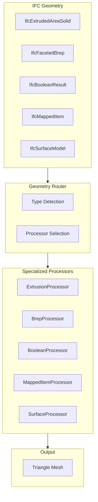

## Geometry Representation Types

### IFC Geometry Hierarchy

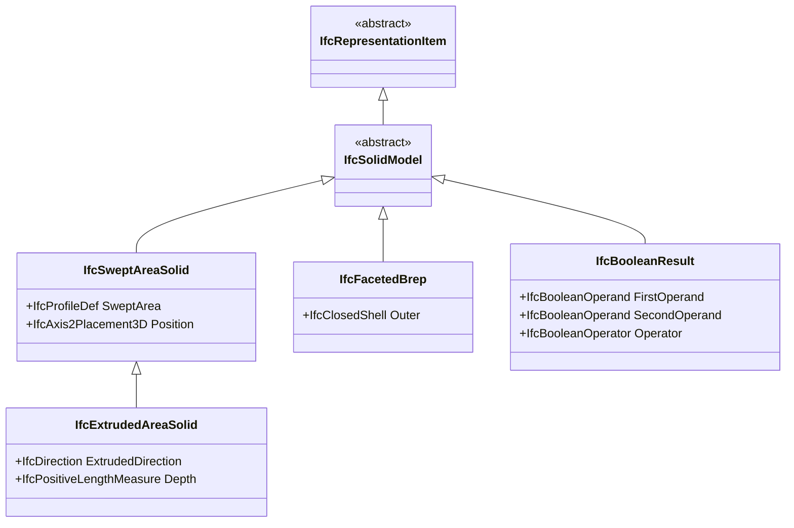

### Coverage by Type

| Geometry Type | Coverage | Notes |
|---------------|----------|-------|
| IfcExtrudedAreaSolid | Full | Most common |
| IfcFacetedBrep | Full | Pre-triangulated |
| IfcBooleanClippingResult | Partial | CSG operations |
| IfcMappedItem | Full | Instancing |
| IfcSurfaceModel | Partial | Surface meshes |
| IfcTriangulatedFaceSet | Full | IFC4 triangles |

## Extrusion Processing

### Pipeline

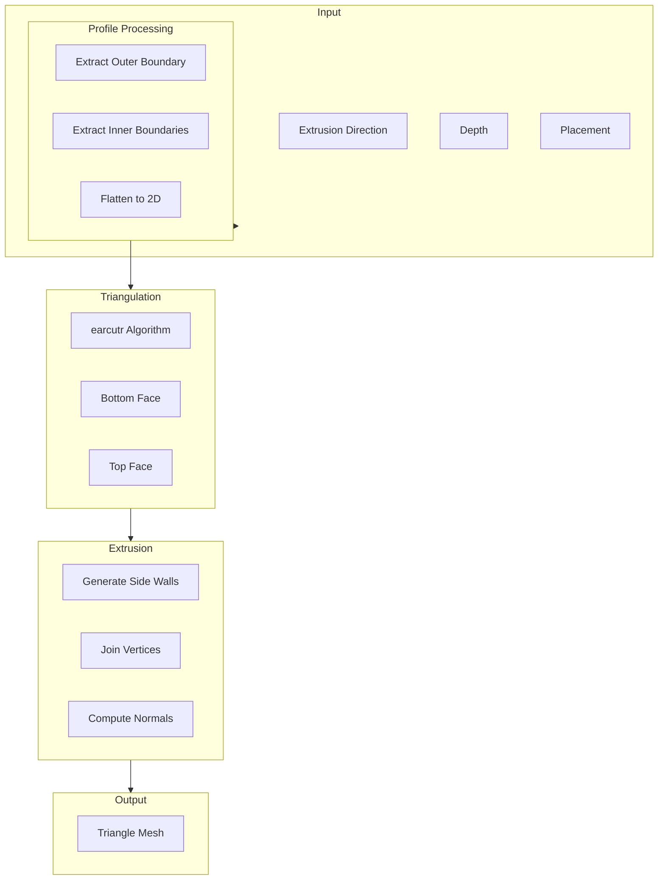

### Profile Types

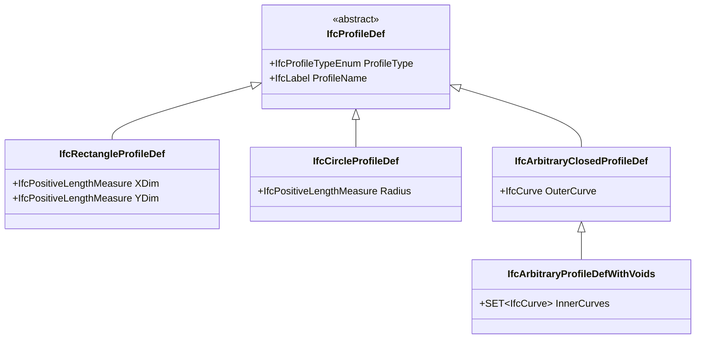

### Earcut Algorithm

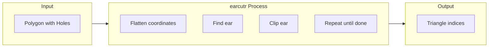

```rust
use earcutr::earcut;

fn triangulate_profile(
    outer: &[Point2],
    holes: &[Vec<Point2>]
) -> Vec<u32> {
    // Flatten to coordinate array
    let mut coords: Vec<f64> = Vec::new();
    let mut hole_indices: Vec<usize> = Vec::new();

    // Add outer boundary
    for p in outer {
        coords.push(p.x);
        coords.push(p.y);
    }

    // Add holes
    for hole in holes {
        hole_indices.push(coords.len() / 2);
        for p in hole {
            coords.push(p.x);
            coords.push(p.y);
        }
    }

    // Triangulate
    earcut(&coords, &hole_indices, 2)
        .unwrap()
        .into_iter()
        .map(|i| i as u32)
        .collect()
}
```

## Brep Processing

### FacetedBrep Pipeline

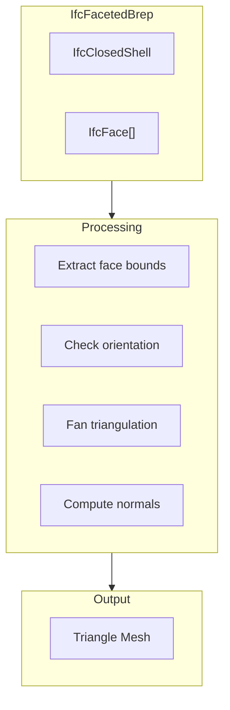

### Face Triangulation

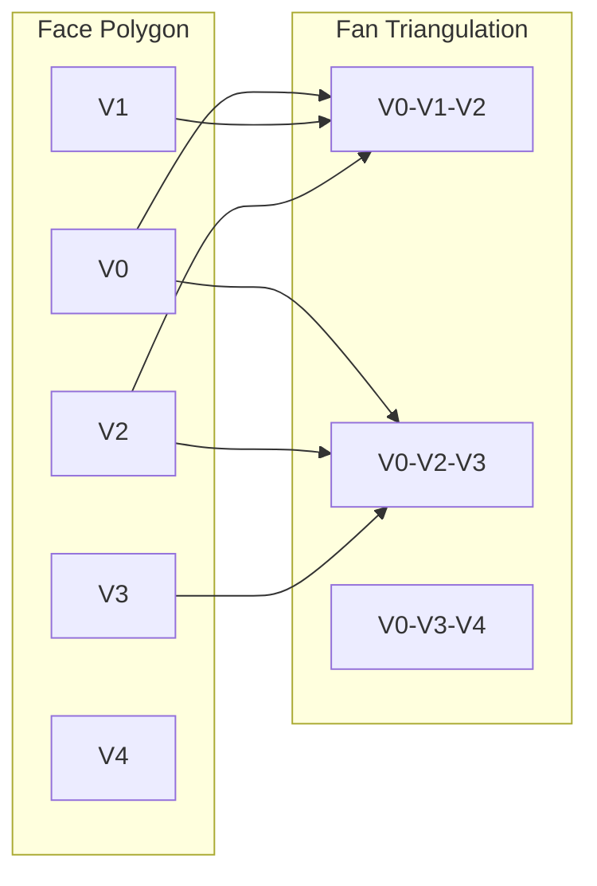

## Boolean Operations

### CSG Pipeline

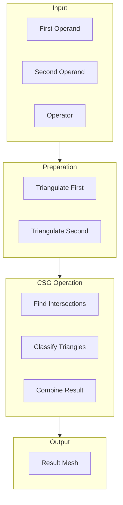

### Boolean Operators

| Operator | Description | Common Use |
|----------|-------------|------------|
| DIFFERENCE | A - B | Wall openings |
| UNION | A + B | Composite shapes |
| INTERSECTION | A ∩ B | Clipping |

## Coordinate Transformations

### Placement Stack

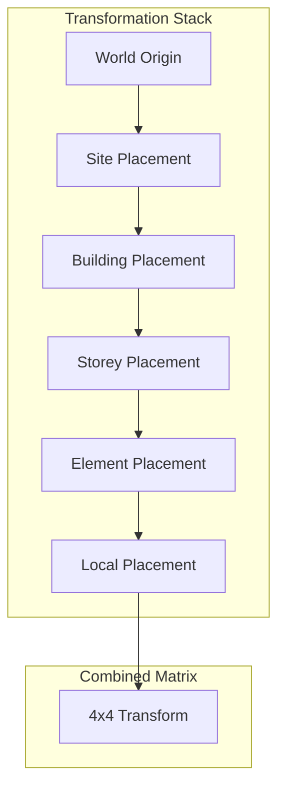

### Matrix Operations

```rust
use nalgebra::{Matrix4, Point3, Vector3};

fn compute_transform(placements: &[Placement]) -> Matrix4<f64> {
    let mut result = Matrix4::identity();

    for placement in placements {
        let local = Matrix4::new_translation(&placement.location)
            * Matrix4::from_axis_angle(&placement.axis, placement.angle);
        result = result * local;
    end

    result
}

fn transform_point(point: Point3<f64>, matrix: &Matrix4<f64>) -> Point3<f64> {
    matrix.transform_point(&point)
}
```

### Large Coordinate Handling

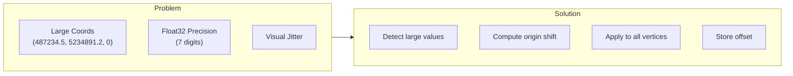

```typescript
function computeOriginShift(bounds: BoundingBox): Vector3 {
  const threshold = 10000; // Shift if > 10km from origin

  if (Math.abs(bounds.center.x) > threshold ||
      Math.abs(bounds.center.y) > threshold) {
    return {
      x: -bounds.center.x,
      y: -bounds.center.y,
      z: 0
    };
  }

  return { x: 0, y: 0, z: 0 };
}
```

## Quality Modes

### Curve Discretization

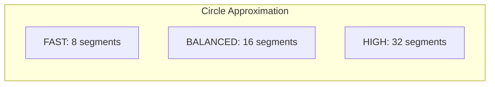

| Mode | Segments | Triangles | Use Case |
|------|----------|-----------|----------|
| FAST | 8 | Fewer | Mobile, preview |
| BALANCED | 16 | Medium | Default |
| HIGH | 32 | More | Detailed viewing |

## Mapped Representations

IFC reuses geometry via `IfcMappedItem` (a source `IfcRepresentationMap` plus a
per-instance placement transform). The engine **expands** each mapped item into
its own tessellated mesh — the source geometry is tessellated once and the
result is transformed per placement. There is no GPU-instancing path: the
renderer instead groups the resulting meshes by colour into a small number of
batched draw calls (see the rendering guide), which keeps draw-call counts low
without a separate instance buffer.

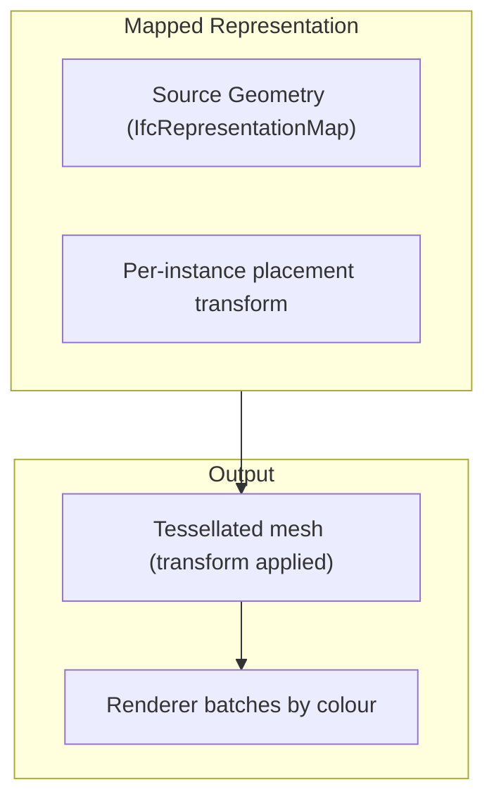

## Streaming Pipeline

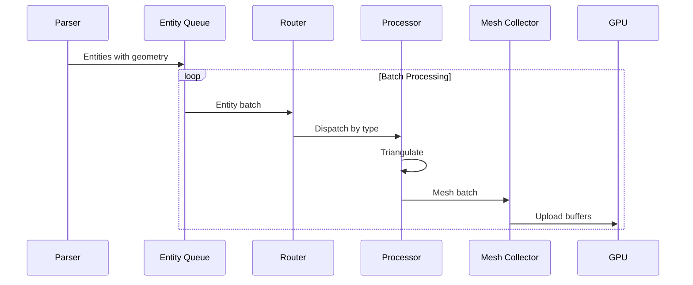

### Batch Processing

```typescript
async function processGeometryBatches(
  entities: Entity[],
  batchSize: number,
  onBatch: (batch: MeshBatch) => Promise<void>
): Promise<void> {
  const geoEntities = entities.filter(e => e.hasGeometry);

  for (let i = 0; i < geoEntities.length; i += batchSize) {
    const batch = geoEntities.slice(i, i + batchSize);
    const meshes = await Promise.all(
      batch.map(e => processEntity(e))
    );

    await onBatch({
      meshes,
      bounds: computeBounds(meshes),
      progress: (i + batch.length) / geoEntities.length
    });
  }
}
```

## CSG Kernel

ONE kernel: the in-tree **pure-Rust exact mesh-arrangement kernel**
(`rust/geometry/src/kernel/`), on every target — native (server, CLI, SDK)
and `wasm32-unknown-unknown` (viewer) alike. The kernel architecture
(exact predicate cascade, conforming arrangement, winding classification,
deterministic output ordering) is documented in the module docs under
`rust/geometry/src/kernel/`.

Key properties:

- **Exact**: every in/out and on-plane decision routes through exact
  geometric predicates (Shewchuk adaptive floats escalating to exact
  rational arithmetic), so coplanar faces, shared seams and
  flush-cap cuts are decided correctly, not by epsilon.
- **Platform-deterministic**: identical output bytes on x86_64, aarch64
  and wasm32 (pinned by the determinism manifests in
  `rust/geometry/tests/`).
- **No operand cap**: arbitrary operand sizes; cost is bounded by the
  pre-arrangement complexity budget in the void router rather than a
  hard polygon cap.
- **N-ary union**: `kernel::mesh_bridge::union_many` unions all cutter
  prisms in ONE arrangement (issue #960 segmented-roof seams).
- **Failure surface**: on any kernel failure the host mesh is returned
  un-cut and a structured `BoolFailure` record is emitted (drainable via
  `GeometryRouter::take_csg_failures`). The regression gates assert
  `total_failures == 0` on `AC20-FZK-Haus.ifc`,
  `C20-Institute-Var-2.ifc` and `AC-20-Smiley-West-10-Bldg.ifc`.

History (June 2026): two earlier kernels — the legacy BSP port of
csg.js (`bsp_csg.rs`, 128-polygon operand cap, server/wasm default) and
the Manifold C++ kernel (`manifold_kernel.rs` + `manifold-csg-sys`,
viewer/native feature) — were deleted in the kernel consolidation
once the pure-Rust kernel reached parity. With them went the whole
C++ cross-toolchain (cmake, LLVM-20/libc++, emsdk on Vercel) and the
`manifold-csg`/`manifold-csg-wasm-uu` Cargo features; the geometry crate
builds with `default = []` everywhere. There is no kernel selection —
build-time or runtime.

## Performance Metrics

| Operation | Time (typical) | Notes |
|-----------|---------------|-------|
| Profile extraction | 0.1 ms | Per entity |
| Earcut triangulation | 0.5 ms | Simple profile |
| Extrusion | 0.2 ms | Per entity |
| Boolean operation | 5-50 ms | Complex |
| Transform application | 0.01 ms | Per vertex |

### Throughput

- **Simple extrusions**: ~2000 entities/sec
- **Complex Breps**: ~200 entities/sec
- **Boolean operations**: ~20 entities/sec

## Next Steps

- [Rendering Pipeline](rendering-pipeline.md) - WebGPU rendering
- [API Reference](../api/rust.md) - Geometry API
