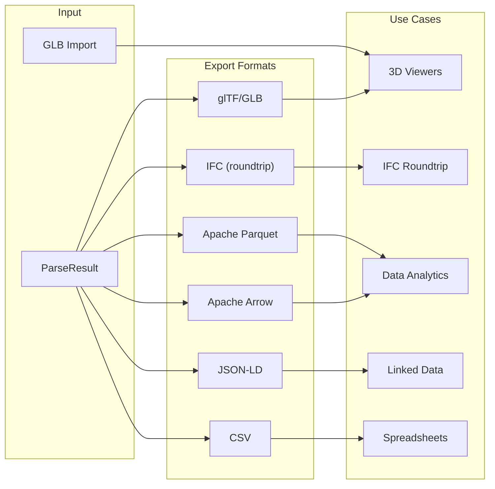
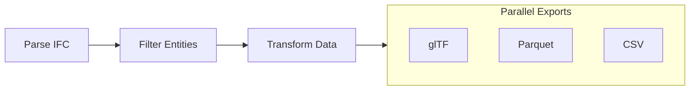

# Exporting Data

Guide to exporting IFC data in various formats.

## Quick Start: CDN Export (No Build Required)

Export IFC to GLB directly in the browser with zero setup:

```html
<!DOCTYPE html>
<html>
<head>
    <meta charset="UTF-8">
    <title>IFC to GLB Export</title>
</head>
<body>
    <input type="file" id="file" accept=".ifc">
    <div id="status"></div>

    <script type="module">
        import { GeometryProcessor } from "https://cdn.jsdelivr.net/npm/@ifc-lite/geometry@1.2.1/+esm";
        import initWasm from "https://cdn.jsdelivr.net/npm/@ifc-lite/wasm@1.2.1/+esm";

        // Initialize WASM with explicit path for CDN
        const wasmUrl = "https://cdn.jsdelivr.net/npm/@ifc-lite/wasm@1.2.1/pkg/ifc-lite_bg.wasm";
        await initWasm({ module_or_path: wasmUrl });

        document.getElementById("file").addEventListener("change", async (e) => {
            const file = e.target.files[0];
            if (!file) return;

            try {
                const processor = new GeometryProcessor();
                await processor.init();

                const buffer = new Uint8Array(await file.arrayBuffer());
                const result = await processor.process(buffer);

                // GLB is assembled in Rust (ifc-lite-export) over the meshes the
                // processor already produced — no re-meshing.
                const glb = processor.exportGlbFromMeshes(result.meshes);

                // Download the GLB file
                const blob = new Blob([glb], { type: "model/gltf-binary" });
                const url = URL.createObjectURL(blob);
                const a = document.createElement("a");
                a.href = url;
                a.download = file.name.replace(/\.ifc$/i, ".glb");
                a.click();
                URL.revokeObjectURL(url);

                document.getElementById("status").textContent = "Done!";
                processor.dispose();
            } catch (error) {
                document.getElementById("status").textContent = "Error: " + error.message;
            }
        });
    </script>
</body>
</html>
```

!!! note "HTTP Server Required"
    This file must be served from an HTTP server (not `file://`). Use `npx serve .` or `python -m http.server 8000`.

## Overview

IFClite supports multiple export formats, as well as GLB import for loading existing 3D assets:



## glTF / GLB Export

GLB is assembled in Rust (`ifc-lite-export`) and reached through `GeometryProcessor`
in `@ifc-lite/geometry`. (The old `GLTFExporter` class was retired.)

```typescript
import { GeometryProcessor } from '@ifc-lite/geometry';

const gp = new GeometryProcessor();
await gp.init();

// From IFC bytes (meshes internally):
const glb = gp.exportGlb(
  bytes,                 // Uint8Array of the .ifc
  true,                  // includeMetadata → expressId/globalId/type in node extras
  new Uint32Array(),     // hidden  express-ids (empty ⇒ none hidden)
  new Uint32Array(),     // isolated express-ids (empty ⇒ all visible)
  '',                    // hidden IFC-type CSV (e.g. 'IfcSpace,IfcOpeningElement')
);
await saveFile('model.glb', glb);

// Or, if you already meshed the model, skip the re-mesh:
const result = await gp.process(bytes);
const glb2 = gp.exportGlbFromMeshes(result.meshes, /* includeMetadata */ true);
```

`exportGlb` always emits a single binary **GLB** (`model/gltf-binary`). Per-element
RTC origins ride a glTF node translation so large-coordinate models stay precise.

### glTF Options

| Parameter | Meaning |
|-----------|---------|
| `includeMetadata` | Write `expressId` / `globalId` / `type` (and properties) into each node's `extras` |
| `hidden` | Express-ids to omit (mirrors the viewer's hide set) |
| `isolated` | Express-ids to keep; empty ⇒ all visible |
| hidden-types CSV | IFC class names to drop wholesale, e.g. `IfcSpace,IfcOpeningElement` |

### glTF with Properties

```typescript
const glb = gp.exportGlb(bytes, /* includeMetadata */ true, new Uint32Array(), new Uint32Array(), '');

// Properties are stored in node extras:
// {
//   "nodes": [{
//     "name": "Wall-001",
//     "extras": {
//       "expressId": 123,
//       "globalId": "2O2Fr$...",
//       "type": "IFCWALL",
//       "properties": {
//         "Pset_WallCommon": {
//           "IsExternal": true,
//           "FireRating": 60
//         }
//       }
//     }
//   }]
// }
```

## Parquet Export

Export to Apache Parquet for analytics with tools like DuckDB, Pandas, or Polars:

```typescript
import { ParquetExporter } from '@ifc-lite/export';

const exporter = new ParquetExporter();

// Export entities
const entitiesParquet = await exporter.exportEntities(parseResult);
await saveFile('entities.parquet', entitiesParquet);

// Export properties
const propsParquet = await exporter.exportProperties(parseResult);
await saveFile('properties.parquet', propsParquet);

// Export quantities
const quantsParquet = await exporter.exportQuantities(parseResult);
await saveFile('quantities.parquet', quantsParquet);

// Export all tables
const bundle = await exporter.exportAll(parseResult);
await saveFile('entities.parquet', bundle.entities);
await saveFile('properties.parquet', bundle.properties);
await saveFile('quantities.parquet', bundle.quantities);
await saveFile('relationships.parquet', bundle.relationships);
```

### Parquet Schema

```mermaid
erDiagram
    ENTITIES {
        int64 express_id PK
        string type
        string global_id
        string name
        string description
        boolean has_geometry
    }

    PROPERTIES {
        int64 entity_id FK
        string pset_name
        string prop_name
        string value
        string value_type
    }

    QUANTITIES {
        int64 entity_id FK
        string name
        float64 value
        string unit
    }

    RELATIONSHIPS {
        int64 from_id FK
        int64 to_id FK
        string rel_type
    }

    ENTITIES ||--o{ PROPERTIES : has
    ENTITIES ||--o{ QUANTITIES : has
    ENTITIES ||--o{ RELATIONSHIPS : from
    ENTITIES ||--o{ RELATIONSHIPS : to
```

### Using Parquet with Python

```python
import polars as pl

# Load exported data
entities = pl.read_parquet('entities.parquet')
properties = pl.read_parquet('properties.parquet')
quantities = pl.read_parquet('quantities.parquet')

# Analyze wall areas
wall_areas = (
    entities
    .filter(pl.col('type').str.contains('IFCWALL'))
    .join(quantities, left_on='express_id', right_on='entity_id')
    .filter(pl.col('name') == 'NetArea')
    .group_by('type')
    .agg([
        pl.count('express_id').alias('count'),
        pl.sum('value').alias('total_area'),
        pl.mean('value').alias('avg_area')
    ])
)
print(wall_areas)
```

## JSON-LD Export

Export as linked data for semantic web applications:

JSON-LD is produced in Rust (`ifc-lite-export`) via `GeometryProcessor`:

```typescript
import { GeometryProcessor } from '@ifc-lite/geometry';

const gp = new GeometryProcessor();
await gp.init();

const jsonld = gp.exportJsonld(
  bytes,                 // Uint8Array of the .ifc
  '',                    // ontology context ('' ⇒ buildingSMART IFC4 ADD2 OWL)
  true,                  // includeProperties
  false,                 // includeQuantities
  true,                  // pretty
  new Uint32Array(),     // express-id isolation filter (empty ⇒ all entities)
);

await saveFile('model.jsonld', jsonld);
```

### JSON-LD Structure

```json
{
  "@context": {
    "ifc": "https://standards.buildingsmart.org/IFC/DEV/IFC4/ADD2/OWL#",
    "schema": "https://schema.org/",
    "geo": "http://www.opengis.net/ont/geosparql#"
  },
  "@graph": [
    {
      "@id": "https://example.com/project/wall-123",
      "@type": "ifc:IfcWall",
      "ifc:globalId": "2O2Fr$t4X7Zf8NOew3FL9r",
      "ifc:name": "Wall-001",
      "ifc:hasPropertySet": [
        {
          "@type": "ifc:IfcPropertySet",
          "ifc:name": "Pset_WallCommon",
          "ifc:hasProperty": [
            {
              "@type": "ifc:IfcPropertySingleValue",
              "ifc:name": "IsExternal",
              "ifc:value": true
            }
          ]
        }
      ]
    }
  ]
}
```

## CSV Export

Export tabular data for spreadsheet applications:

CSV is produced in Rust (`ifc-lite-export`) via `GeometryProcessor`. The `mode`
selects the table; `includeProperties` adds flattened `Pset_Prop` columns to the
entities view:

```typescript
import { GeometryProcessor } from '@ifc-lite/geometry';

const gp = new GeometryProcessor();
await gp.init();

// mode ∈ 'entities' | 'properties' | 'quantities' | 'spatial'
const entitiesCsv = gp.exportCsv(bytes, 'entities', ',', /* includeProperties */ true);
await saveFile('entities.csv', entitiesCsv);

const propsCsv = gp.exportCsv(bytes, 'properties');
await saveFile('properties.csv', propsCsv);

const quantsCsv = gp.exportCsv(bytes, 'quantities');
await saveFile('quantities.csv', quantsCsv);

// Spatial-hierarchy outline (expressId, globalId, name, type, parentId, level)
const spatialCsv = gp.exportCsv(bytes, 'spatial');
await saveFile('spatial.csv', spatialCsv);
```

### CSV Output Example

```csv
expressId,type,globalId,name,IsExternal,FireRating,LoadBearing
123,IFCWALL,2O2Fr$t4X7Zf8NOew3FL9r,Wall-001,true,60,true
456,IFCWALLSTANDARDCASE,3P3Gs$u5Y8Ag9PQfx4GM0s,Wall-002,false,30,false
```

## IFC Export

Export back to IFC format for roundtrip workflows and interoperability with other BIM tools:

```typescript
import { StepExporter } from '@ifc-lite/export';

const exporter = new StepExporter(dataStore, sourceBuffer);

// Full export
const result = exporter.export();
await saveFile('model.ifc', result.content);

// Visible-only export (exclude hidden entities)
const visibleResult = exporter.export({
  visibleOnly: true,
  hiddenEntityIds: hiddenSet,       // Set<number> of local expressIds
  isolatedEntityIds: isolatedSet,   // Set<number> | null
});
await saveFile('visible_only.ifc', visibleResult.content);
```

### Visible-Only Export

When `visibleOnly` is enabled, the exporter:

1. Always includes infrastructure (units, owner history) and spatial structure
2. Checks each product entity against `hiddenEntityIds` / `isolatedEntityIds`
3. Walks `#ID` references transitively to include all dependent geometry, properties, and materials
4. Collects `IfcStyledItem` entities via reverse reference pass (preserves colors/materials)
5. Propagates visibility to openings via `IfcRelVoidsElement` (hidden slab = hidden openings)

Supports all 202 `IfcProduct` subtypes from IFC4 and IFC4X3 schemas, including infrastructure types (bridges, roads, railways, marine facilities).

### Multi-Model Merged Export

Merge multiple IFC models into a single file. The models are passed to the
constructor; `export()` (sync) or `exportAsync()` (progress-reporting) takes the
options:

```typescript
import { MergedExporter } from '@ifc-lite/export';

const exporter = new MergedExporter([
  { id: 'arch', name: 'Architecture', dataStore: store1 },
  { id: 'struct', name: 'Structure', dataStore: store2 },
]);
const result = await exporter.exportAsync({
  schema: 'IFC4',
  unitReconciliation: 'normalize',
  visibleOnly: true,
});
await saveFile('merged.ifc', result.content);
```

#### Mixed length units

When the models use different length units, `unitReconciliation` controls the
result:

| Mode | Behaviour |
|------|-----------|
| `'auto'` (default) | Unit-aware: same-unit models are unified; a differing-unit model is **federated** as its own `IfcProject` so its raw coordinates stay correctly scaled. The output then holds more than one `IfcProject` (flagged in `stats.warnings`). |
| `'normalize'` | Rescales every length-valued datum of a differing-unit model into the first model's unit, then unifies it — the output is **one single-unit `IfcProject`** that opens correctly everywhere. `stats.normalizedModelCount` reports how many models were rescaled. |
| `'assume-shared'` | Forces one project without rescaling. Use only when units are already normalised; mixing real units this way mis-scales geometry. |

#### Spatial matching strategy

By default, `IfcSite`/`IfcBuilding` are matched by Name (case-insensitive),
falling back to unifying a lone instance in each model when no name matches;
`IfcBuildingStorey` is matched by Name, falling back to Elevation (±0.5 model
units). To pin down the exact strategy — mirroring IfcOpenShell/BlenderBIM's
"Merge Projects" recipe — pass:

```typescript
const result = exporter.export({
  schema: 'IFC4',
  mergeSites: 'single',              // 'single' | 'by-name'
  mergeBuildings: 'by-name',         // 'single' | 'by-name'
  mergeStoreys: 'by-name-then-elevation', // 'by-name' | 'by-elevation' | 'by-name-then-elevation'
});
```

`'single'` ignores Name and unifies iff each model contributes exactly one
instance of that container type. `'by-name'` requires a Name match with no
single-instance fallback. All three fields are optional; omitting one keeps
the pre-existing combined heuristic for that container type.

`'normalize'` rescales all `IfcCartesianPoint`/`IfcCartesianPointList` coordinates,
scalar lengths (extrusion depths, profile dimensions, radii, thicknesses, storey
elevations, `IfcVector.Magnitude`, CSG primitive sizes), `IfcLengthMeasure`
property values and `IfcQuantityLength`. Areas and volumes are converted by their
own declared `AREAUNIT`/`VOLUMEUNIT` ratio. Angles, ratios, counts, unit
definitions and georeferencing offsets are left untouched. Length attributes
specific to IFC4X3 (alignment / linear referencing) may not be rescaled — a
`stats.warnings` advisory flags this.

## GLB Import

Load existing GLB files for viewing alongside IFC models:

```typescript
import { GlbImporter } from '@ifc-lite/import';

const importer = new GlbImporter();
const glbBuffer = await fetch('model.glb').then(r => r.arrayBuffer());
const meshes = await importer.import(new Uint8Array(glbBuffer));

// Add imported meshes to the renderer
renderer.addMeshes(meshes);
```

## Arrow Export

Export to Apache Arrow for in-memory analytics and streaming pipelines:

```typescript
import { ArrowExporter } from '@ifc-lite/export';

const exporter = new ArrowExporter();
const arrowBuffer = await exporter.exportEntities(parseResult);

// Use with Arrow-compatible tools (DuckDB, DataFusion, etc.)
await saveFile('entities.arrow', arrowBuffer);
```

## Custom Export

Create custom export formats:

```typescript
import { ExportPipeline } from '@ifc-lite/export';

import { extractPropertiesOnDemand, extractQuantitiesOnDemand } from '@ifc-lite/parser';

// Define custom exporter
class CustomExporter {
  export(store: IfcDataStore, buffer: Uint8Array): CustomFormat {
    const output: CustomFormat = {
      metadata: {
        schema: store.schemaVersion,
        timestamp: new Date().toISOString()
      },
      elements: []
    };

    // Get all wall expressIds
    const wallIds = store.entityIndex.byType.get('IFCWALL') ?? [];

    for (const expressId of wallIds) {
      const entityRef = store.entityIndex.byId.get(expressId);
      if (entityRef) {
        output.elements.push({
          id: expressId,
          name: entityRef.name,
          properties: extractPropertiesOnDemand(store, expressId, buffer),
          quantities: extractQuantitiesOnDemand(store, expressId, buffer)
        });
      }
    }

    return output;
  }
}

// Use custom exporter
const exporter = new CustomExporter();
const custom = exporter.export(store, buffer);
```

## Filtered Export

Export only specific entities:

The Rust exporters take an express-id **isolation set** (`isolated`) — empty means
"all visible". Build it from a query and pass it through:

```typescript
import { GeometryProcessor } from '@ifc-lite/geometry';
import { IfcQuery } from '@ifc-lite/query';

// Filter entities with query
const query = new IfcQuery(parseResult);
const externalWalls = query
  .walls()
  .whereProperty('Pset_WallCommon', 'IsExternal', '=', true)
  .toArray();

const isolated = new Uint32Array(externalWalls.map((w) => w.expressId));

const gp = new GeometryProcessor();
await gp.init();

// GLB of just the matched walls …
const glb = gp.exportGlb(bytes, true, new Uint32Array(), isolated, '');
// … the same `isolated` set also filters OBJ, STEP and JSON-LD:
const jsonld = gp.exportJsonld(bytes, '', true, false, true, isolated);
```

## Export Pipeline

Chain multiple exports:



```typescript
import { ExportPipeline } from '@ifc-lite/export';

const pipeline = new ExportPipeline(parseResult);

// Run multiple exports in parallel
const results = await pipeline.export([
  { format: 'glb', options: { useDraco: true } },
  { format: 'parquet', tables: ['entities', 'properties'] },
  { format: 'csv', columns: ['expressId', 'type', 'name'] }
]);

// Save all results
await saveFile('model.glb', results.glb);
await saveFile('entities.parquet', results.parquet.entities);
await saveFile('entities.csv', results.csv);
```

## Next Steps

- [Query Guide](querying.md) - Filter data before export
- [API Reference](../api/typescript.md) - Complete API docs
