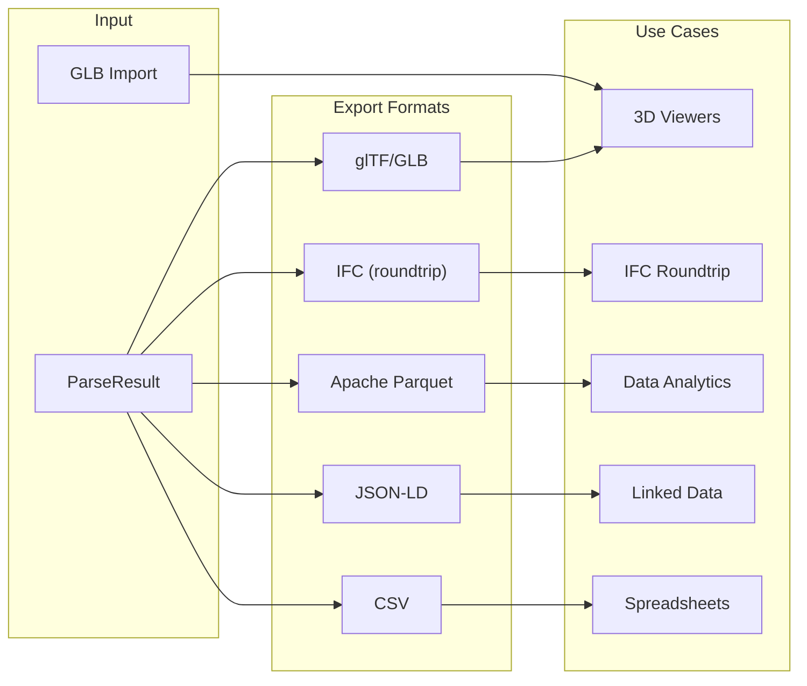
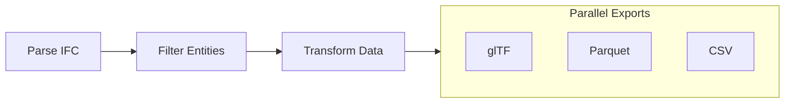

# Exporting Data

Guide to exporting IFC data in various formats.

## Quick Start: CDN Export (No Build Required)

Export IFC to GLB directly in the browser with zero setup:

```html
<!DOCTYPE html>
<html>
<head>
    <meta charset="UTF-8">
    <title>IFC to GLB Export</title>
</head>
<body>
    <input type="file" id="file" accept=".ifc">
    <div id="status"></div>

    <script type="module">
        import { GeometryProcessor } from "https://cdn.jsdelivr.net/npm/@ifc-lite/geometry/+esm";
        import initWasm from "https://cdn.jsdelivr.net/npm/@ifc-lite/wasm/+esm";

        // Initialize WASM with explicit path for CDN
        const wasmUrl = "https://cdn.jsdelivr.net/npm/@ifc-lite/wasm/pkg/ifc-lite_bg.wasm";
        await initWasm({ module_or_path: wasmUrl });

        document.getElementById("file").addEventListener("change", async (e) => {
            const file = e.target.files[0];
            if (!file) return;

            try {
                const processor = new GeometryProcessor();
                await processor.init();

                const buffer = new Uint8Array(await file.arrayBuffer());
                const result = await processor.process(buffer);

                // GLB is assembled in Rust (ifc-lite-export) over the meshes the
                // processor already produced — no re-meshing.
                const glb = processor.exportGlbFromMeshes(result.meshes);

                // Download the GLB file
                const blob = new Blob([glb], { type: "model/gltf-binary" });
                const url = URL.createObjectURL(blob);
                const a = document.createElement("a");
                a.href = url;
                a.download = file.name.replace(/\.ifc$/i, ".glb");
                a.click();
                URL.revokeObjectURL(url);

                document.getElementById("status").textContent = "Done!";
                processor.dispose();
            } catch (error) {
                document.getElementById("status").textContent = "Error: " + error.message;
            }
        });
    </script>
</body>
</html>
```

!!! note "HTTP Server Required"
    This file must be served from an HTTP server (not `file://`). Use `npx serve .` or `python -m http.server 8000`.

## Overview

IFClite supports multiple export formats, as well as GLB import for loading existing 3D assets:



## glTF / GLB Export

GLB is assembled in Rust (`ifc-lite-export`) and reached through `GeometryProcessor`
in `@ifc-lite/geometry`. (The old `GLTFExporter` class was retired.)

```typescript
import { GeometryProcessor } from '@ifc-lite/geometry';

const gp = new GeometryProcessor();
await gp.init();

// From IFC bytes (meshes internally):
const glb = gp.exportGlb(
  bytes,                 // Uint8Array of the .ifc
  true,                  // includeMetadata: expressId/ifcType/GlobalId in node extras
  new Uint32Array(),     // hidden  express-ids (empty = none hidden)
  new Uint32Array(),     // isolated express-ids (empty = all visible)
  '',                    // hidden IFC-type CSV (e.g. 'IfcSpace,IfcOpeningElement')
  true,                  // lit: PBR materials; false = flat KHR_materials_unlit
);
await saveFile('model.glb', glb);

// Or, if you already meshed the model, skip the re-mesh:
const result = await gp.process(bytes);
const glb2 = gp.exportGlbFromMeshes(result.meshes, /* includeMetadata */ true);
```

`exportGlb` always emits a single binary **GLB** (`model/gltf-binary`). Per-element
RTC origins ride a glTF node translation so large-coordinate models stay precise.

### glTF Options

| Parameter | Meaning |
|-----------|---------|
| `includeMetadata` | Write `expressId` / `ifcType` / `GlobalId` (plus `modelId` for federated exports) into each node's `extras` |
| `hidden` | Express-ids to omit (mirrors the viewer's hide set) |
| `isolated` | Express-ids to keep; empty = all visible |
| hidden-types CSV | IFC class names to drop wholesale, e.g. `IfcSpace,IfcOpeningElement` |
| `lit` | `true` (default) emits standard PBR materials that shade from normals; `false` emits flat `KHR_materials_unlit` materials |

### glTF with Metadata

```typescript
const glb = gp.exportGlb(bytes, /* includeMetadata */ true, new Uint32Array(), new Uint32Array(), '');

// With includeMetadata, each node carries identifying extras:
// {
//   "nodes": [{
//     "name": "Wall-001",
//     "extras": {
//       "expressId": 123,
//       "ifcType": "IfcWall",
//       "GlobalId": "2O2Fr$t4X7Zf8NOew3FL9r"
//     }
//   }]
// }
```

Property sets are not embedded in the GLB; export them separately (CSV, JSON-LD,
Parquet) and join on `expressId` / `GlobalId` when you need both.

## Parquet Export

Export to Apache Parquet for analytics with tools like DuckDB, Pandas, or Polars:

```typescript
import { ParquetExporter } from '@ifc-lite/export';

// The exporter needs the parsed data store. Pass a GeometryResult too if
// you also want the vertex/index/mesh tables:
const exporter = new ParquetExporter(store, geometryResult);

// Export the whole model as a single .bos archive (a ZIP of Parquet files:
// Entities, Properties, Quantities, Relationships, Strings, a Metadata.json,
// SpatialHierarchy when available, plus the VertexBuffer/IndexBuffer/Meshes
// tables when a GeometryResult was supplied; pass { includeGeometry: false }
// to skip them):
const bos = await exporter.exportBOS();
await saveFile('model.bos', bos);

// Or export one table at a time. Valid names: 'entities' | 'properties' |
// 'quantities' | 'relationships' | 'strings' | 'vertices' | 'indices' | 'meshes'.
const entitiesParquet = await exporter.exportTable('entities');
await saveFile('entities.parquet', entitiesParquet);

const propsParquet = await exporter.exportTable('properties');
await saveFile('properties.parquet', propsParquet);

const quantsParquet = await exporter.exportTable('quantities');
await saveFile('quantities.parquet', quantsParquet);
```

### Parquet Schema

Column names are PascalCase (ara3d BIM Open Schema style); entity types are
PascalCase class names such as `IfcWall`:

```mermaid
erDiagram
    ENTITIES {
        int64 ExpressId PK
        string GlobalId
        string Name
        string Description
        string Type
        string ObjectType
        boolean HasGeometry
        boolean IsType
    }

    PROPERTIES {
        int64 EntityId FK
        string PsetName
        string PropName
        string PropType
        string ValueString
        float64 ValueReal
        int64 ValueInt
        boolean ValueBool
    }

    QUANTITIES {
        int64 EntityId FK
        string QsetName
        string QuantityName
        string QuantityType
        float64 Value
        string Formula
    }

    RELATIONSHIPS {
        int64 SourceId FK
        int64 TargetId FK
        string RelType
        int64 RelId
    }

    ENTITIES ||--o{ PROPERTIES : has
    ENTITIES ||--o{ QUANTITIES : has
    ENTITIES ||--o{ RELATIONSHIPS : from
    ENTITIES ||--o{ RELATIONSHIPS : to
```

### Using Parquet with Python

```python
import polars as pl

# Load exported data
entities = pl.read_parquet('entities.parquet')
properties = pl.read_parquet('properties.parquet')
quantities = pl.read_parquet('quantities.parquet')

# Analyze wall areas
wall_areas = (
    entities
    .filter(pl.col('Type').str.contains('IfcWall'))
    .join(quantities, left_on='ExpressId', right_on='EntityId')
    .filter(pl.col('QuantityName') == 'NetArea')
    .group_by('Type')
    .agg([
        pl.count('ExpressId').alias('count'),
        pl.sum('Value').alias('total_area'),
        pl.mean('Value').alias('avg_area')
    ])
)
print(wall_areas)
```

## JSON-LD Export

Export as linked data for semantic web applications:

JSON-LD is produced in Rust (`ifc-lite-export`) via `GeometryProcessor`:

```typescript
import { GeometryProcessor } from '@ifc-lite/geometry';

const gp = new GeometryProcessor();
await gp.init();

const jsonld = gp.exportJsonld(
  bytes,                 // Uint8Array of the .ifc
  '',                    // ontology context ('' ⇒ buildingSMART IFC4 ADD2 OWL)
  true,                  // includeProperties
  false,                 // includeQuantities
  true,                  // pretty
  new Uint32Array(),     // express-id isolation filter (empty ⇒ all entities)
);

await saveFile('model.jsonld', jsonld);
```

### JSON-LD Structure

```json
{
  "@context": {
    "@vocab": "https://standards.buildingsmart.org/IFC/DEV/IFC4/ADD2/OWL#",
    "ifc": "https://standards.buildingsmart.org/IFC/DEV/IFC4/ADD2/OWL#"
  },
  "@graph": [
    {
      "@id": "ifc:123",
      "@type": "ifc:IfcWall",
      "ifc:expressId": 123,
      "ifc:globalId": "2O2Fr$t4X7Zf8NOew3FL9r",
      "ifc:name": "Wall-001",
      "ifc:hasPropertySets": [
        {
          "@type": "ifc:IfcPropertySet",
          "ifc:name": "Pset_WallCommon",
          "ifc:hasProperties": [
            {
              "@type": "ifc:IfcPropertySingleValue",
              "ifc:name": "IsExternal",
              "ifc:nominalValue": true
            }
          ]
        }
      ]
    }
  ]
}
```

With `includeQuantities`, each entity additionally carries `ifc:hasQuantitySets`
(`ifc:IfcElementQuantity` nodes with typed `ifc:IfcQuantity...` entries).

## CSV Export

Export tabular data for spreadsheet applications:

CSV is produced in Rust (`ifc-lite-export`) via `GeometryProcessor`. The `mode`
selects the table; `includeProperties` adds flattened `Pset_Prop` columns to the
entities view:

```typescript
import { GeometryProcessor } from '@ifc-lite/geometry';

const gp = new GeometryProcessor();
await gp.init();

// mode ∈ 'entities' | 'properties' | 'quantities' | 'spatial'
const entitiesCsv = gp.exportCsv(bytes, 'entities', ',', /* includeProperties */ true);
await saveFile('entities.csv', entitiesCsv);

const propsCsv = gp.exportCsv(bytes, 'properties');
await saveFile('properties.csv', propsCsv);

const quantsCsv = gp.exportCsv(bytes, 'quantities');
await saveFile('quantities.csv', quantsCsv);

// Spatial-hierarchy outline (expressId, globalId, name, type, parentId, level)
const spatialCsv = gp.exportCsv(bytes, 'spatial');
await saveFile('spatial.csv', spatialCsv);
```

### CSV Output Example

The `entities` mode emits the fixed columns
`expressId,globalId,name,type,description,objectType,hasGeometry`; with
`includeProperties`, each property becomes a flattened `Pset_Prop` column:

```csv
expressId,globalId,name,type,description,objectType,hasGeometry,Pset_WallCommon_IsExternal,Pset_WallCommon_FireRating
123,2O2Fr$t4X7Zf8NOew3FL9r,Wall-001,IfcWall,,,true,true,60
456,3P3Gs$u5Y8Ag9PQfx4GM0s,Wall-002,IfcWallStandardCase,,,true,false,30
```

## IFC Export

Export back to IFC format for roundtrip workflows and interoperability with other BIM tools:

```typescript
import { StepExporter } from '@ifc-lite/export';

const exporter = new StepExporter(dataStore);

// Full export (schema is required; conversion runs when it differs from the source)
const result = exporter.export({ schema: 'IFC4' });
await saveFile('model.ifc', result.content);  // result.content is a Uint8Array

// Visible-only export (exclude hidden entities)
const visibleResult = exporter.export({
  schema: 'IFC4',
  visibleOnly: true,
  hiddenEntityIds: hiddenSet,       // Set<number> of local expressIds
  isolatedEntityIds: isolatedSet,   // Set<number> | null
});
await saveFile('visible_only.ifc', visibleResult.content);
```

To bake in pending property edits, pass the `MutablePropertyView` from
`@ifc-lite/mutations` to the constructor; `applyMutations` defaults to true
when a view is provided (see the [Property Editing guide](mutations.md)):

```typescript
const edited = new StepExporter(dataStore, mutationView)
  .export({ schema: 'IFC4', applyMutations: true });
```

For quick scripts there is also `exportToStep(dataStore, options?)`, which
returns the STEP text as a string (defaults to `schema: 'IFC4'`; prefer
`StepExporter` and its `Uint8Array` output for very large files).

### Visible-Only Export

When `visibleOnly` is enabled, the exporter:

1. Always includes infrastructure (units, owner history) and spatial structure
2. Checks each product entity against `hiddenEntityIds` / `isolatedEntityIds`
3. Walks `#ID` references transitively to include all dependent geometry, properties, and materials
4. Collects `IfcStyledItem` entities via reverse reference pass (preserves colors/materials)
5. Propagates visibility to openings via `IfcRelVoidsElement` (hidden slab = hidden openings)

Supports all 202 `IfcProduct` subtypes from IFC4 and IFC4X3 schemas, including infrastructure types (bridges, roads, railways, marine facilities).

### Multi-Model Merged Export

Merge multiple IFC models into a single file. The models are passed to the
constructor; `export()` (sync) or `exportAsync()` (yields to the event loop for
progress reporting, and required when any model carries pending mutation-view
edits to bake) takes the options:

```typescript
import { MergedExporter } from '@ifc-lite/export';

const exporter = new MergedExporter([
  { id: 'arch', name: 'Architecture', dataStore: store1 },
  { id: 'struct', name: 'Structure', dataStore: store2 },
]);
const result = await exporter.exportAsync({
  schema: 'IFC4',
  unitReconciliation: 'normalize',
  visibleOnly: true,
});
await saveFile('merged.ifc', result.content);
```

#### Mixed length units

When the models use different length units, `unitReconciliation` controls the
result:

| Mode | Behaviour |
|------|-----------|
| `'auto'` (default) | Unit-aware: same-unit models are unified; a differing-unit model is **federated** as its own `IfcProject` so its raw coordinates stay correctly scaled. The output then holds more than one `IfcProject` (flagged in `stats.warnings`). |
| `'normalize'` | Rescales every length-valued datum of a differing-unit model into the first model's unit, then unifies it — the output is **one single-unit `IfcProject`** that opens correctly everywhere. `stats.normalizedModelCount` reports how many models were rescaled. |
| `'assume-shared'` | Forces one project without rescaling. Use only when units are already normalised; mixing real units this way mis-scales geometry. |

#### Spatial matching strategy

By default, `IfcSite`/`IfcBuilding` are matched by Name (case-insensitive),
falling back to unifying a lone instance in each model when no name matches;
`IfcBuildingStorey` is matched by Name, falling back to Elevation (±0.5 model
units). To pin down the exact strategy — mirroring IfcOpenShell/BlenderBIM's
"Merge Projects" recipe — pass:

```typescript
import { MergedExporter } from '@ifc-lite/export';

const exporter = new MergedExporter([
  { id: 'arch', name: 'Architecture', dataStore: store1 },
  { id: 'struct', name: 'Structure', dataStore: store2 },
]);

const result = exporter.export({
  schema: 'IFC4',
  mergeSites: 'single',              // 'single' | 'by-name'
  mergeBuildings: 'by-name',         // 'single' | 'by-name'
  mergeStoreys: 'by-name-then-elevation', // 'by-name' | 'by-elevation' | 'by-name-then-elevation'
});
```

`'single'` ignores Name and unifies iff each model contributes exactly one
instance of that container type. `'by-name'` requires a Name match with no
single-instance fallback. All three fields are optional; omitting one keeps
the pre-existing combined heuristic for that container type.

`'normalize'` rescales all `IfcCartesianPoint`/`IfcCartesianPointList` coordinates,
scalar lengths (extrusion depths, profile dimensions, radii, thicknesses, storey
elevations, `IfcVector.Magnitude`, CSG primitive sizes), `IfcLengthMeasure`
property values and `IfcQuantityLength`. Areas and volumes are converted by their
own declared `AREAUNIT`/`VOLUMEUNIT` ratio. Angles, ratios, counts, unit
definitions and georeferencing offsets are left untouched. Length attributes
specific to IFC4X3 (alignment / linear referencing) may not be rescaled — a
`stats.warnings` advisory flags this.

## IFC5 (IFCX) Export

Export a parsed model as an IFC5 IFCX document (JSON with USD-style composition):

```typescript
import { Ifc5Exporter } from '@ifc-lite/export';

// geometryResult and mutationView are optional
const exporter = new Ifc5Exporter(dataStore, geometryResult);
const result = exporter.export({
  includeGeometry: true,     // USD meshes (default true)
  includeProperties: true,   // default true
  prettyPrint: true,         // default true
});
await saveFile('model.ifcx', result.content);  // string; result.stats has counts
```

A Rust-side variant is also available as `GeometryProcessor.exportIfcx(bytes, onlyKnownProperties?, pretty?)`.

## Other Formats via GeometryProcessor

The Rust exporter crate backs several more one-call formats on `GeometryProcessor`:

| Method | Output |
|--------|--------|
| `exportObj(bytes, includeNormals?, hidden?, isolated?)` | Wavefront OBJ of the render geometry |
| `exportJson(bytes, pretty?, includeProperties?, includeQuantities?)` | Plain JSON entity dump |
| `exportStep(bytes, schema?, included?, mutationsJson?)` | STEP/IFC re-export (Rust path) |
| `exportHbjson(bytes, name)` | Honeybee HBJSON energy/daylight model built from the `IfcSpace` volumes |
| `exportKmz(glb, lat, lon, alt, xAxisAbscissa?, xAxisOrdinate?, name?)` | KMZ (Google Earth) wrapping an already-exported GLB at a georeferenced location |
| `exportMerged(buffers, schema?)` | Merge several IFC byte buffers into one STEP file (Rust path) |

Each returns a `Uint8Array` (UTF-8 for the text formats; decode with `TextDecoder` when you need a string), or `null` if the processor is not initialized.

## GLB Import

Load existing GLB files for viewing alongside IFC models:

```typescript
import { parseGLBToMeshData } from '@ifc-lite/export';

const glbBuffer = await fetch('model.glb').then(r => r.arrayBuffer());
const meshes = parseGLBToMeshData(new Uint8Array(glbBuffer)); // MeshData[]

// Add imported meshes to the renderer
renderer.addMeshes(meshes);
```

## Custom Export

Create custom export formats:

```typescript
import {
  extractEntityAttributesOnDemand,
  extractPropertiesOnDemand,
  extractQuantitiesOnDemand,
} from '@ifc-lite/parser';

// Shape of the format you are exporting to
interface CustomFormat {
  metadata: { schema: string; timestamp: string };
  elements: Array<Record<string, unknown>>;
}

// Define custom exporter
class CustomExporter {
  export(store: IfcDataStore): CustomFormat {
    const output: CustomFormat = {
      metadata: {
        schema: store.schemaVersion,
        timestamp: new Date().toISOString()
      },
      elements: []
    };

    // Get all wall expressIds
    const wallIds = store.entityIndex.byType.get('IFCWALL') ?? [];

    for (const expressId of wallIds) {
      const entityRef = store.entityIndex.byId.get(expressId);
      if (entityRef) {
        // EntityRef has no name; resolve it from the store on demand.
        output.elements.push({
          id: expressId,
          name: extractEntityAttributesOnDemand(store, expressId).name,
          properties: extractPropertiesOnDemand(store, expressId),
          quantities: extractQuantitiesOnDemand(store, expressId)
        });
      }
    }

    return output;
  }
}

// Use custom exporter
const exporter = new CustomExporter();
const custom = exporter.export(store);
```

## Filtered Export

Export only specific entities:

The Rust exporters take an express-id **isolation set** (`isolated`) — empty means
"all visible". Build it from a query and pass it through:

```typescript
import { GeometryProcessor } from '@ifc-lite/geometry';
import { IfcQuery } from '@ifc-lite/query';

// Filter entities with query
const query = new IfcQuery(store); // store from parseColumnar()
const externalWalls = query
  .walls()
  .whereProperty('Pset_WallCommon', 'IsExternal', '=', true)
  .execute();

const isolated = new Uint32Array(externalWalls.map((w) => w.expressId));

const gp = new GeometryProcessor();
await gp.init();

// GLB of just the matched walls …
const glb = gp.exportGlb(bytes, true, new Uint32Array(), isolated, '');
// … the same `isolated` set also filters OBJ, STEP and JSON-LD:
const jsonld = gp.exportJsonld(bytes, '', true, false, true, isolated);
```

## Export Pipeline

Chain multiple exports:



```typescript
import { GeometryProcessor } from '@ifc-lite/geometry';
import { ParquetExporter } from '@ifc-lite/export';

const gp = new GeometryProcessor();
await gp.init();

// There is no single pipeline class — compose the real exporters you need.
const glb = gp.exportGlb(bytes, true, new Uint32Array(), new Uint32Array(), '');
const entitiesParquet = await new ParquetExporter(store).exportTable('entities');
const csv = gp.exportCsv(bytes, 'entities', ',', /* includeProperties */ true);

// Save all results
await saveFile('model.glb', glb);
await saveFile('entities.parquet', entitiesParquet);
await saveFile('entities.csv', csv);
```

## Next Steps

- [Query Guide](querying.md) - Filter data before export
- [API Reference](../api/typescript.md) - Complete API docs
