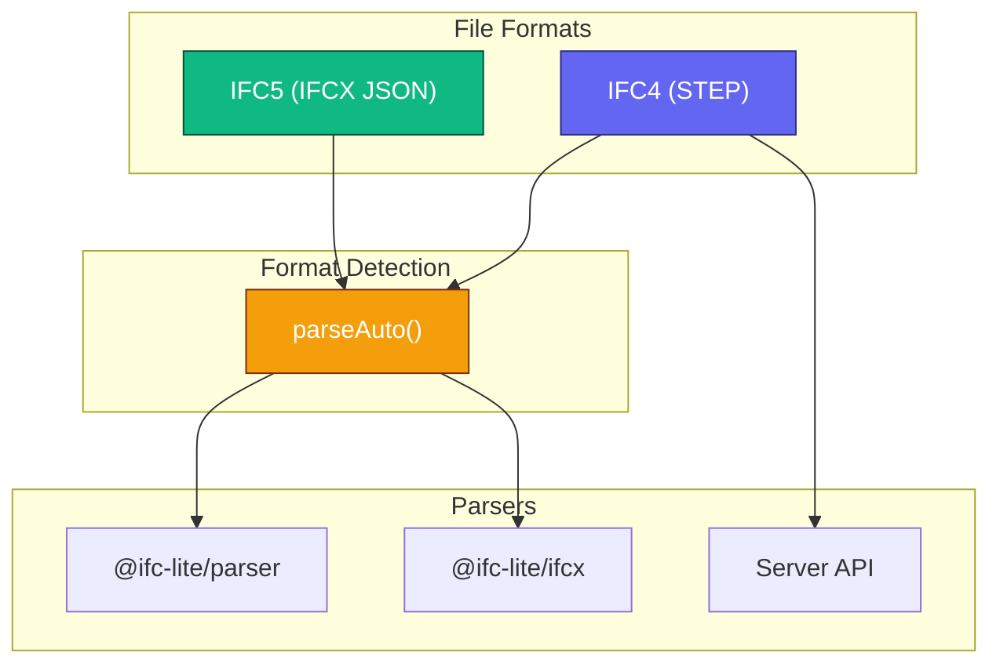
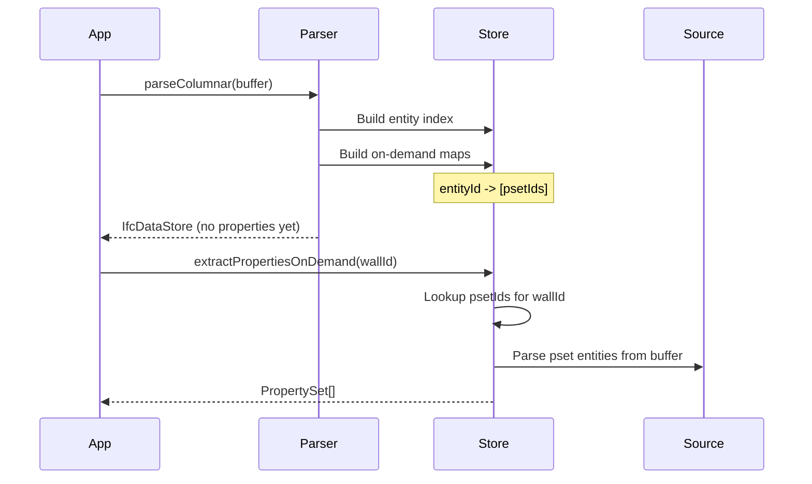

# Parsing IFC Files

Complete guide to parsing IFC files with IFClite, covering both IFC4 (STEP) and IFC5 (IFCX) formats.

## Overview

IFClite supports the columnar STEP parser for IFC4-style files and the IFCX
parser for IFC5 JSON files:

| Aspect | Options |
|--------|---------|
| **Processing** | Client-side (WASM) or Server-side (Rust) |
| **Format** | IFC4 (STEP) or IFC5 (IFCX JSON) |
| **Mode** | Columnar or streaming |



## Client-Side Parsing

### Basic Parsing

```typescript
import { IfcParser } from '@ifc-lite/parser';

const parser = new IfcParser();
const buffer = await fetch('model.ifc').then(r => r.arrayBuffer());

// Columnar parse (returns IfcDataStore - recommended for all STEP files)
const store = await parser.parseColumnar(buffer);
```

`parseColumnar()` is the canonical IFC STEP path. It centralizes scan selection
across pre-scanned indexes, the browser worker scanner, the WASM byte scanner,
and the TypeScript tokenizer fallback, then builds an `IfcDataStore` for
on-demand extraction. `parse()` remains as a compatibility adapter for callers
that still need the older eager `ParseResult` shape.

### Columnar Parsing (Recommended)

The columnar parser returns an `IfcDataStore` with memory-efficient data structures:

```typescript
const store = await parser.parseColumnar(buffer, {
  onProgress: ({ phase, percent }) => {
    console.log(`${phase}: ${percent}%`);
  }
});

// Access entities by type
const wallIds = store.entityIndex.byType.get('IFCWALL') ?? [];
const doorIds = store.entityIndex.byType.get('IFCDOOR') ?? [];

// Access entity by ID
const entityRef = store.entityIndex.byId.get(123);

// Metadata
console.log(`Schema: ${store.schemaVersion}`);  // IFC2X3, IFC4, IFC4X3, IFC5
console.log(`Entities: ${store.entityCount}`);
console.log(`Parse time: ${store.parseTime}ms`);
```

### Browser Worker Mode

For non-blocking parsing in the browser, `WorkerParser` runs the columnar
parser in a Web Worker. It takes a `SharedArrayBuffer` (so the same bytes can
also be handed to the geometry workers without a copy), which requires a
cross-origin-isolated page:

```typescript
import { WorkerParser } from '@ifc-lite/parser/browser';

if (WorkerParser.isSupported()) {
  // Copy the file bytes into a SharedArrayBuffer
  const sab = new SharedArrayBuffer(buffer.byteLength);
  new Uint8Array(sab).set(new Uint8Array(buffer));

  const parser = new WorkerParser();
  const store = await parser.parseColumnar(sab, {
    onProgress: ({ phase, percent }) => {
      // Updates from worker thread
      updateProgressUI(phase, percent);
    }
  });
  // The worker self-terminates after each parse; call parser.terminate()
  // only to cancel an in-flight parse early.
} else {
  // Fall back to the in-process parser (no SAB / not cross-origin isolated)
  const store = await new IfcParser().parseColumnar(buffer);
}
```

### Streaming Geometry

For large files, stream geometry progressively using `GeometryProcessor.processStreaming()`:

```typescript
import { GeometryProcessor } from '@ifc-lite/geometry';

const parser = new IfcParser();
const geometry = new GeometryProcessor();
await geometry.init();

// Parse first (fast, metadata only)
const store = await parser.parseColumnar(buffer);

// Stream geometry progressively
for await (const event of geometry.processStreaming(new Uint8Array(buffer))) {
  switch (event.type) {
    case 'start':
      console.log(`Starting geometry extraction`);
      break;
    case 'batch':
      // Add meshes to renderer as they arrive
      renderer.addMeshes(event.meshes, true);  // isStreaming = true
      progressBar.value = event.totalSoFar;  // cumulative mesh count (no percentage on batch events)
      break;
    case 'complete':
      console.log(`Done: ${event.totalMeshes} meshes`);
      renderer.fitToView();
      break;
  }
}
```

## On-Demand Property Extraction

Properties and quantities are extracted lazily for better performance with large files:

```typescript
import {
  extractPropertiesOnDemand,
  extractQuantitiesOnDemand,
  extractEntityAttributesOnDemand
} from '@ifc-lite/parser';

// Parse without pre-loading properties
const store = await parser.parseColumnar(buffer);

// Extract properties only when needed
const wallId = wallIds[0];
const psets = extractPropertiesOnDemand(store, wallId);

for (const pset of psets) {
  console.log(`Property Set: ${pset.name}`);
  for (const prop of pset.properties) {
    console.log(`  ${prop.name}: ${prop.value}`);
  }
}

// Extract quantities
const qsets = extractQuantitiesOnDemand(store, wallId);
for (const qset of qsets) {
  console.log(`Quantity Set: ${qset.name}`);
  for (const qty of qset.quantities) {
    console.log(`  ${qty.name}: ${qty.value} ${qty.type}`);
  }
}

// Extract IFC attributes
const attrs = extractEntityAttributesOnDemand(store, wallId);
console.log(`Name: ${attrs.name}`);
console.log(`GlobalId: ${attrs.globalId}`);
console.log(`Description: ${attrs.description}`);
```

### How On-Demand Works



## IFC5 (IFCX) Parsing

IFClite natively supports the new IFC5 JSON-based format with ECS composition and USD geometry.

### Format Detection

```typescript
import { parseAuto } from '@ifc-lite/parser';
import { detectFormat } from '@ifc-lite/ifcx';

// Auto-detect and parse
const result = await parseAuto(buffer);

if (result.format === 'ifcx') {
  // IFC5 file: parsed data lives under result.data, meshes at the top level
  const { entities, spatialHierarchy } = result.data;
  const meshes = result.meshes;
} else {
  // IFC4 STEP file: the IfcDataStore is result.data
  const store = result.data;
}

// Or detect format manually
const format = detectFormat(buffer);  // 'ifc', 'ifcx', 'glb', or 'unknown'
```

### `.ifcZIP` Containers

`parseAuto` (and every built-in loader — CLI, MCP, the viewer) transparently
unwraps the buildingSMART `.ifcZIP` container format: a zip archive wrapping
a single `.ifc`/`.ifcxml` file. Feed it the zip bytes directly — no manual
unzip step needed:

```typescript
import { parseAuto, unwrapIfcZip } from '@ifc-lite/parser';

// parseAuto detects and unwraps .ifcZIP automatically
const result = await parseAuto(zipBuffer);

// Or unwrap explicitly (a no-op for a non-zip buffer)
const ifcBuffer = await unwrapIfcZip(zipBuffer);
```

Referenced resources inside the archive (textures, documents) are not
extracted — only the model file's bytes. An archive with zero or more than
one `.ifc`/`.ifcxml` entry throws rather than guessing which one to load.

### Direct IFCX Parsing

```typescript
import { parseIfcx } from '@ifc-lite/ifcx';

const result = await parseIfcx(buffer, {
  onProgress: ({ phase, percent }) => {
    console.log(`${phase}: ${percent}%`);
  }
});

// IFC5 uses ECS (Entity-Component-System) composition
console.log(`Entities: ${result.entityCount}`);
console.log(`Meshes: ${result.meshes.length}`);

// Pre-tessellated USD geometry
for (const mesh of result.meshes) {
  console.log(`Entity #${mesh.expressId}: ${mesh.ifcType}`);
  // mesh.positions, mesh.normals, mesh.indices ready for GPU
}

// Same data structures as IFC4
console.log(`Schema: ${result.schemaVersion}`);  // 'IFC5'
console.log(`Parse time: ${result.parseTime}ms`);
```

### IFC5 Features

| Feature | Description |
|---------|-------------|
| **ECS Composition** | Entities composed from components (attributes) |
| **USD Geometry** | Pre-tessellated meshes (no WASM triangulation needed) |
| **Layer Semantics** | Multiple nodes at same path merge (later overrides) |
| **Namespace Attributes** | Properties prefixed with namespace (e.g., `bsi::ifc::prop::`) |
| **JSON Format** | Human-readable, streamable |

### IFC5 Data Model

`parseIfcx` returns the same columnar tables as the STEP parser
(`EntityTable`, `PropertyTable`, `QuantityTable`, `RelationshipGraph`,
`SpatialHierarchy`), plus IFCX-specific path mappings:

```typescript
import { parseIfcx } from '@ifc-lite/ifcx';

const result = await parseIfcx(buffer);

// Columnar entity table
const { entities } = result;
for (const id of entities.expressId) {
  console.log(`Entity #${id}: ${entities.getTypeName(id)}`);
  console.log(`  GlobalId: ${entities.getGlobalId(id)}`);
  console.log(`  Name: ${entities.getName(id)}`);
  console.log(`  Has geometry: ${entities.hasGeometry(id)}`);
}

// Pick an element to inspect (first IfcWall in the table)
const wallId = result.entities.expressId.find(
  (id) => result.entities.getTypeName(id) === 'IfcWall',
)!;

// Property sets for an element (namespace-prefixed names)
for (const pset of result.properties.getForEntity(wallId)) {
  console.log(`PropertySet: ${pset.name}`);
  for (const prop of pset.properties) {
    console.log(`  ${prop.name}: ${prop.value}`);
  }
}

// Spatial hierarchy
const hierarchy = result.spatialHierarchy;
console.log(`Project: ${hierarchy.project.name}`);

// Element-to-storey lookup
const storeyId = hierarchy.elementToStorey.get(wallId);

// IFCX path <-> express ID mappings
const path = result.idToPath.get(wallId);
const id = result.pathToId.get(path);
```

## Server-Side Parsing

For production deployments, use the server for parallel processing and caching:

```typescript
import { IfcServerClient } from '@ifc-lite/server-client';

const client = new IfcServerClient({
  baseUrl: 'http://localhost:3001'
});

// Parquet format (15x smaller than JSON)
const result = await client.parseParquet(file);

// Streaming for large files (onBatch callback fires per geometry batch)
await client.parseParquetStream(file, (batch) => {
  // batch.meshes are server MeshData (snake_case fields like express_id);
  // map them to your renderer's mesh format before uploading.
  console.log(`Batch ${batch.batch_number}: ${batch.meshes.length} meshes`);
});
```

See the [Server Guide](server.md) for complete server documentation.

## Parse Options

```typescript
interface ParseOptions {
  // Progress callback
  onProgress?: (progress: { phase: string; percent: number }) => void;

  // Diagnostic message callback
  onDiagnostic?: (message: string) => void;

  // Optional IfcAPI instance for WASM-accelerated entity scanning
  wasmApi?: WasmScanApi;

  // Yield budget for large incremental parses (higher finishes faster with longer main-thread slices)
  yieldIntervalMs?: number;

  // Keep property-set containers indexed but defer individual property/quantity atoms
  deferPropertyAtomIndex?: boolean;

  // Skip worker-based entity scanning and stay in-process
  disableWorkerScan?: boolean;

  // Called when spatial hierarchy is ready, before property/association parsing completes
  onSpatialReady?: (partialStore: IfcDataStore) => void;

  // Pre-built entity index from another worker (e.g. the streaming geometry pre-pass)
  preScannedEntityIndex?: PreScannedEntityIndex;
}

const store = await parser.parseColumnar(buffer, {
  deferPropertyAtomIndex: true,
  onProgress: ({ phase, percent }) => console.log(`${phase}: ${percent}%`)
});
```

Tessellation and geometry quality are configured on the `GeometryProcessor`,
not on `parseColumnar()`.

## IfcDataStore Structure

```typescript
interface IfcDataStore {
  // Metadata
  fileSize: number;
  schemaVersion: 'IFC2X3' | 'IFC4' | 'IFC4X3' | 'IFC5';
  entityCount: number;
  parseTime: number;

  // Raw source (for on-demand parsing)
  source: Uint8Array;

  // Entity index
  entityIndex: {
    byId: Map<number, EntityRef>;      // expressId -> EntityRef
    byType: Map<string, number[]>;     // type -> [expressId, ...]
  };

  // Columnar tables
  strings: StringTable;                 // Deduplicated strings
  entities: EntityTable;                // Entity metadata
  properties: PropertyTable;            // Pre-computed (or empty for on-demand)
  quantities: QuantityTable;            // Pre-computed (or empty for on-demand)
  relationships: RelationshipGraph;     // Relationship edges

  // Spatial structures
  spatialHierarchy?: SpatialHierarchy;
  spatialIndex?: SpatialIndex;

  // On-demand maps
  onDemandPropertyMap?: Map<number, number[]>;   // entityId -> [psetId, ...]
  onDemandQuantityMap?: Map<number, number[]>;   // entityId -> [qsetId, ...]
}
```

## Spatial Hierarchy

```typescript
import { IfcTypeEnum } from '@ifc-lite/data';

// spatialHierarchy is optional on IfcDataStore; guard before use
const hierarchy = store.spatialHierarchy;
if (!hierarchy) throw new Error('No spatial hierarchy in this model');

// Project structure
console.log(`Project: ${hierarchy.project.name}`);

// Navigate storeys (SpatialNode.type is a numeric IfcTypeEnum)
for (const child of hierarchy.project.children) {
  if (child.type === IfcTypeEnum.IfcBuildingStorey) {
    const storey = child;
    console.log(`Storey: ${storey.name}`);

    // Get elements on this storey (byStorey is keyed by the storey express id)
    const elements = hierarchy.byStorey.get(storey.expressId) ?? [];
    console.log(`  Elements: ${elements.length}`);

    // Get storey elevation
    const elevation = hierarchy.storeyElevations.get(storey.expressId);
    console.log(`  Elevation: ${elevation}m`);
  }
}

// Find storey for an element
const storeyId = hierarchy.elementToStorey.get(wallId);
```

## Schema Support

| Schema | Entities | Status |
|--------|----------|--------|
| IFC2X3 | - | :material-check: Supported |
| IFC4 | 776 | :material-check: Full Support |
| IFC4X3 | 876 | :material-check: Supported |
| IFC5 (IFCX) | - | :material-check: Beta |

Entity counts are taken from the EXPRESS schemas the code generators consume
(`IFC4_ADD2_TC1`, `IFC4X3`). IFC2X3 files are parsed with the same pipeline;
the runtime schema registry itself is generated from IFC4.

### Schema Registry

Access runtime schema metadata (generated from `IFC4_ADD2_TC1`):

```typescript
import {
  SCHEMA_REGISTRY,
  getEntityMetadata,
  getAllAttributesForEntity,
  isKnownEntity
} from '@ifc-lite/parser';

// Check if entity type is known
if (isKnownEntity('IFCWALL')) {
  const meta = getEntityMetadata('IFCWALL');
  console.log(`Parent: ${meta.parent}`);         // 'IfcBuildingElement'
  console.log(`Abstract: ${meta.isAbstract}`);   // false

  // Get all attributes including inherited
  const attrs = getAllAttributesForEntity('IFCWALL');
  for (const attr of attrs) {
    console.log(`${attr.name}: ${attr.type}`);
  }
}
```

## Advanced Extractors

### Materials

```typescript
import {
  extractMaterials,
  getMaterialForElement,
  getMaterialNameForElement
} from '@ifc-lite/parser';

// The batch extractors read the legacy Map representation from a
// ParseResult (`parser.parse`), so pass its entity maps, not the store.
const materials = extractMaterials(parseResult.entities, parseResult.entityIndex.byType);

// Get material for an element
// getMaterialForElement returns a material express id (or undefined)
const materialId = getMaterialForElement(wallId, materials);
if (materialId !== undefined) {
  const material = materials.materials.get(materialId);
  if (material) {
    console.log(`Material: ${material.name}`);
  }

  // Layered materials resolve to a MaterialLayerSet of layer ids
  const layerSet = materials.materialLayerSets.get(materialId);
  if (layerSet) {
    for (const layerId of layerSet.layers) {
      const layer = materials.materialLayers.get(layerId);
      if (!layer) continue;
      const layerMat = materials.materials.get(layer.material);
      // layer.thickness is in the file's length unit
      console.log(`  Layer: ${layerMat?.name ?? layer.material} (${layer.thickness})`);
    }
  }
}
```

### Georeferencing

```typescript
import {
  extractGeoreferencing,
  transformToWorld,
  transformToLocal
} from '@ifc-lite/parser';

// Pass a ParseResult's entity maps (`parser.parse`), not the columnar store.
const georef = extractGeoreferencing(parseResult.entities, parseResult.entityIndex.byType);

if (georef) {
  console.log(`CRS: ${georef.projectedCRS?.name}`);
  console.log(`Eastings: ${georef.mapConversion?.eastings}`);
  console.log(`Northings: ${georef.mapConversion?.northings}`);

  // Transform a local coordinate (tuple) to world; returns a tuple or null
  const world = transformToWorld([10, 20, 0], georef);
  if (world) {
    console.log(`World: ${world[0]}, ${world[1]}, ${world[2]}`);
  }
}
```

### Classifications

```typescript
import {
  extractClassifications,
  getClassificationsForElement,
  groupElementsByClassification
} from '@ifc-lite/parser';

// Pass a ParseResult's entity maps (`parser.parse`), not the columnar store.
const classifications = extractClassifications(parseResult.entities, parseResult.entityIndex.byType);

// Get classifications for an element
const codes = getClassificationsForElement(wallId, classifications);
for (const code of codes) {
  console.log(`${code.identification} - ${code.name}`);
  // e.g., "Pr_60_10_32 - External walls" (owning system via code.referencedSource)
}

// Group elements by classification
const groups = groupElementsByClassification(classifications);
groups.forEach((elementIds, code) => {
  console.log(`${code}: ${elementIds.length} elements`);
});
```

## Error Handling

```typescript
import { IfcParser } from '@ifc-lite/parser';

const parser = new IfcParser();

try {
  const store = await parser.parseColumnar(buffer);
} catch (error) {
  // parseColumnar throws standard Error instances on malformed STEP syntax,
  // unknown or unsupported schemas, and other parse failures.
  if (error instanceof Error) {
    console.error(`Parse failed: ${error.message}`);
  } else {
    throw error;
  }
}
```

## Performance Comparison

| Mode | Use Case | Memory | Speed |
|------|----------|--------|-------|
| `parse()` | Small files, full object access | High | Moderate |
| `parseColumnar()` | Most use cases | Low | Fast |
| `GeometryProcessor.processStreaming()` | Large files (>50MB) | Very Low | Progressive |
| Server | Production, caching | Server-side | Fastest (cached) |

### Performance Tips

1. **Use columnar parsing** - `parseColumnar()` for best memory efficiency
2. **Use on-demand properties** - Don't pre-load all properties
3. **Use workers** - Import from `@ifc-lite/parser/browser` for non-blocking
4. **Use server for large files** - Parallel processing and caching
5. **Filter entity types** - Exclude IFCSPACE, IFCOPENINGELEMENT if not needed

## Multi-Model Loading

When working with multiple IFC files (e.g., architectural, structural, and MEP models), use the federation system to load and coordinate them with unified selection and visibility. Each model receives an ID offset to prevent express ID collisions across files. See the [Federation Guide](federation.md) for details on multi-model loading, global ID resolution, and coordinated visibility control.

## Next Steps

- [Server Guide](server.md) - Server-based parsing with caching
- [Geometry Guide](geometry.md) - Process geometry
- [Query Guide](querying.md) - Query parsed data
- [Federation Guide](federation.md) - Load and coordinate multiple models
- [API Reference](../api/typescript.md) - Complete API docs
