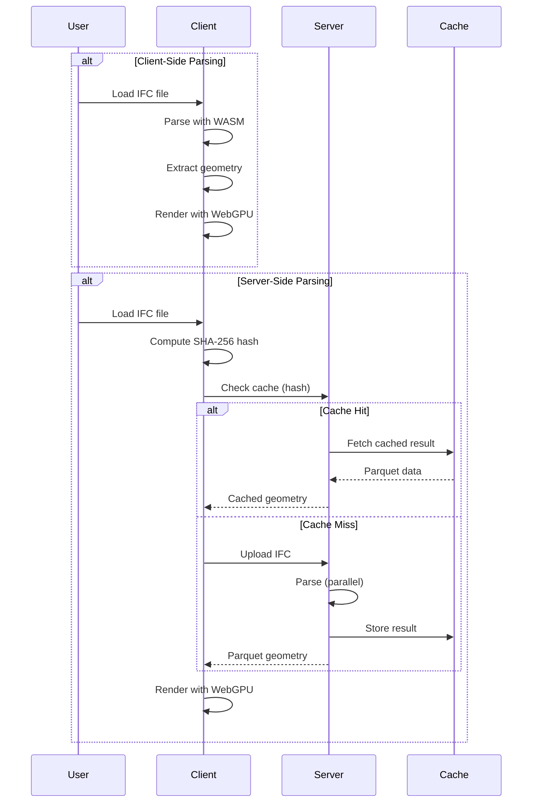

# Quick Start

Get up and running with IFClite in under 5 minutes. Choose your path based on your use case.

!!! tip "Beyond Single-Model Viewing"
    IFClite also supports **multi-model federation** (loading and coordinating multiple IFC files), **BCF** (BIM Collaboration Format) for issue tracking, and **IDS** (Information Delivery Specification) for model validation. See the [Next Steps](#next-steps) section for links to these guides.

## Choose Your Approach

| | Client-Side | Server + Client |
|---|-------------|-----------------|
| **Setup** | `npm install @ifc-lite/parser` | Start server + install client SDK |
| **Processing** | Browser (WASM) | Server (native Rust) |
| **Caching** | IndexedDB (local) | Shared across team |
| **Best for** | Offline, privacy, simple apps | Teams, large files, production |

## Option 1: Client-Side Parsing

Process IFC files entirely in the browser using WebAssembly.

### 1. Create a New Project

=== "React + WebGPU"

    ```bash
    npx create-ifc-lite my-viewer --template react
    cd my-viewer
    npm install
    npm run dev
    ```

=== "Three.js (WebGL)"

    ```bash
    npx create-ifc-lite my-viewer --template threejs
    cd my-viewer
    npm install
    npm run dev
    ```

=== "Babylon.js (WebGL)"

    ```bash
    npx create-ifc-lite my-viewer --template babylonjs
    cd my-viewer
    npm install
    npm run dev
    ```

Open `http://localhost:5173` and drag an IFC file onto the viewer.

!!! tip "No WebGPU? Use Three.js or Babylon.js"
    The `threejs` and `babylonjs` templates use WebGL, which works in all modern browsers. See the [Three.js](../tutorials/threejs-integration.md) and [Babylon.js](../tutorials/babylonjs-integration.md) integration guides for details.

### 2. Or Add to Existing Project

```bash
npm install @ifc-lite/parser @ifc-lite/geometry @ifc-lite/renderer
```

```typescript
// main.ts
import { IfcParser } from '@ifc-lite/parser';
import { GeometryProcessor } from '@ifc-lite/geometry';
import { Renderer } from '@ifc-lite/renderer';

async function main() {
  // Get the canvas element
  const canvas = document.getElementById('viewer') as HTMLCanvasElement;

  // Initialize the renderer
  const renderer = new Renderer(canvas);
  await renderer.init();

  // Initialize the geometry processor (loads WASM)
  const geometry = new GeometryProcessor();
  await geometry.init();

  // Load an IFC file
  const response = await fetch('model.ifc');
  const buffer = await response.arrayBuffer();

  // Parse the IFC file (columnar mode for best performance)
  const parser = new IfcParser();
  const store = await parser.parseColumnar(buffer, {
    onProgress: ({ phase, percent }) => {
      console.log(`Parsing: ${phase} ${percent}%`);
    }
  });

  console.log(`Parsed ${store.entityCount} entities`);

  // Process geometry from the IFC buffer
  const geometryResult = await geometry.process(new Uint8Array(buffer));

  console.log(`Extracted ${geometryResult.meshes.length} meshes`);

  // Load geometry into renderer (creates GPU buffers and batches)
  renderer.loadGeometry(geometryResult);

  // Fit camera to model bounds
  renderer.fitToView();

  // Example: Query entities from the parsed store
  // The store variable from parser.parseColumnar() is available here in the same scope
  const wallIds = store.entityIndex.byType.get('IFCWALL') ?? [];
  console.log(`Found ${wallIds.length} walls`);

  // Start render loop
  function animate() {
    renderer.render();
    requestAnimationFrame(animate);
  }
  animate();

  // Add camera controls (see below)
  setupCameraControls(canvas, renderer);
}

main();
```

### 3. Add Camera Controls

Add orbit, pan, and zoom controls to make the viewer interactive:

```typescript
function setupCameraControls(canvas: HTMLCanvasElement, renderer: Renderer) {
  const camera = renderer.getCamera();
  
  let isDragging = false;
  let isPanning = false;
  let lastX = 0;
  let lastY = 0;

  // Mouse down - start drag
  canvas.addEventListener('mousedown', (e) => {
    isDragging = true;
    isPanning = e.button === 1 || e.button === 2 || e.shiftKey; // Middle/right click or shift = pan
    lastX = e.clientX;
    lastY = e.clientY;
    canvas.style.cursor = isPanning ? 'move' : 'grabbing';
  });

  // Mouse move - orbit or pan
  canvas.addEventListener('mousemove', (e) => {
    if (!isDragging) return;

    const deltaX = e.clientX - lastX;
    const deltaY = e.clientY - lastY;
    lastX = e.clientX;
    lastY = e.clientY;

    if (isPanning) {
      camera.pan(deltaX, deltaY);
    } else {
      camera.orbit(deltaX, deltaY);
    }

    renderer.render();
  });

  // Mouse up - stop drag
  canvas.addEventListener('mouseup', () => {
    isDragging = false;
    isPanning = false;
    canvas.style.cursor = 'grab';
  });

  // Mouse leave - stop drag
  canvas.addEventListener('mouseleave', () => {
    isDragging = false;
    isPanning = false;
  });

  // Scroll wheel - zoom
  canvas.addEventListener('wheel', (e) => {
    e.preventDefault();
    const rect = canvas.getBoundingClientRect();
    const mouseX = e.clientX - rect.left;
    const mouseY = e.clientY - rect.top;
    
    // Zoom towards mouse position
    camera.zoom(e.deltaY, false, mouseX, mouseY, canvas.width, canvas.height);
    renderer.render();
  });

  // Prevent context menu on right-click
  canvas.addEventListener('contextmenu', (e) => e.preventDefault());

  // Set initial cursor
  canvas.style.cursor = 'grab';
}
```

**Camera Methods:**

| Method | Description |
|--------|-------------|
| `camera.orbit(dx, dy)` | Rotate around target (left-drag) |
| `camera.pan(dx, dy)` | Pan the view (shift+drag or middle-click) |
| `camera.zoom(delta, false, x, y, w, h)` | Zoom towards mouse position (scroll wheel) |
| `camera.fitToBounds(min, max)` | Fit camera to bounding box |
| `camera.setPresetView('top')` | Set preset view: 'top', 'front', 'left', etc. |
| `camera.zoomToFit(min, max, 500)` | Animated zoom to fit (with duration in ms) |

## Option 2: Server + Client

Process IFC files on a high-performance Rust server with intelligent caching.

### 1. Start the Server

```bash
# Using Docker
docker run -p 3001:8080 ghcr.io/LTplus-AG/ifc-lite-server

# Or using native binary
npx @ifc-lite/server-bin
```

### 2. Connect from Client

```bash
npm install @ifc-lite/server-client @ifc-lite/renderer
```

```typescript
import { IfcServerClient } from '@ifc-lite/server-client';
import { Renderer } from '@ifc-lite/renderer';

async function main() {
  const canvas = document.getElementById('viewer') as HTMLCanvasElement;
  const renderer = new Renderer(canvas);
  await renderer.init();

  // Connect to server
  const client = new IfcServerClient({
    baseUrl: 'http://localhost:3001'
  });

  // Load file (input element or drag-drop)
  const fileInput = document.getElementById('file-input') as HTMLInputElement;
  const file = fileInput?.files?.[0];
  if (!file) return;

  // Parse with Parquet format (15x smaller than JSON)
  const result = await client.parseParquet(file);

  console.log(`Parsed ${result.meshes.length} meshes`);
  console.log(`Cache key: ${result.cache_key}`);

  // On repeat loads, the server will return cached data instantly
  // (client computes file hash and checks cache before uploading)
}

main();
```

### 3. Stream Large Files

For files over 50MB, use streaming for progressive rendering:

```typescript
// Stream geometry batches
for await (const event of client.parseStream(file)) {
  switch (event.type) {
    case 'start':
      console.log(`Processing ~${event.total_estimate} entities`);
      break;

    case 'batch':
      // Add meshes to renderer as they arrive (isStreaming=true for throttled batching)
      renderer.addMeshes(event.meshes, true);
      console.log(`Batch ${event.batch_number}: ${event.mesh_count} meshes`);
      break;

    case 'complete':
      console.log(`Done in ${event.stats.total_time_ms}ms`);
      renderer.fitToView();
      break;
  }
}
```

## Understanding the Data

### Entity Index

The parser returns an `IfcDataStore` with columnar data structures:

```typescript
const store = await parser.parseColumnar(buffer);

// Access entities by type
const wallIds = store.entityIndex.byType.get('IFCWALL') ?? [];
const doorIds = store.entityIndex.byType.get('IFCDOOR') ?? [];
const windowIds = store.entityIndex.byType.get('IFCWINDOW') ?? [];

// Access entity by ID
const entityRef = store.entityIndex.byId.get(123);
if (entityRef) {
  console.log(`Entity #${entityRef.expressId}: ${entityRef.type}`);
}

// Get spatial hierarchy
const hierarchy = store.spatialHierarchy;
console.log(`Project: ${hierarchy.project.name}`);

// List storeys
for (const storey of hierarchy.project.children) {
  if (storey.type === 'IFCBUILDINGSTOREY') {
    const elements = hierarchy.byStorey.get(storey.id) ?? [];
    console.log(`${storey.name}: ${elements.length} elements`);
  }
}
```

### On-Demand Properties

Properties are extracted lazily for better performance:

```typescript
import {
  extractPropertiesOnDemand,
  extractQuantitiesOnDemand
} from '@ifc-lite/parser';

// Get properties for a specific entity
const wallId = wallIds[0];
const psets = extractPropertiesOnDemand(store, wallId);

for (const pset of psets) {
  console.log(`Property Set: ${pset.name}`);
  for (const prop of pset.properties) {
    console.log(`  ${prop.name}: ${prop.value}`);
  }
}

// Get quantities
const qsets = extractQuantitiesOnDemand(store, wallId);
for (const qset of qsets) {
  console.log(`Quantity Set: ${qset.name}`);
  for (const qty of qset.quantities) {
    console.log(`  ${qty.name}: ${qty.value} (${qty.type})`);
  }
}
```

## Working with IFC5 (IFCX)

IFClite natively supports the new IFC5 JSON-based format:

```typescript
import { parseAuto } from '@ifc-lite/parser';
import { parseIfcx, detectFormat } from '@ifc-lite/ifcx';

// Auto-detect format
const result = await parseAuto(buffer);

if (result.format === 'ifcx') {
  // IFC5 file (result.data is IfcxParseResult)
  console.log('IFC5 with', result.meshes.length, 'pre-tessellated meshes');
} else {
  // IFC4 STEP file (result.data is IfcDataStore)
  console.log('IFC4 with', result.data.entityCount, 'entities');
}

// Or parse IFCX directly
const format = detectFormat(buffer);
if (format === 'ifcx') {
  const ifcxResult = await parseIfcx(buffer, {
    onProgress: ({ phase, percent }) => console.log(`${phase}: ${percent}%`)
  });

  // IFC5 uses ECS composition - entities have components
  console.log(`Entities: ${ifcxResult.entityCount}`);
  console.log(`Meshes: ${ifcxResult.meshes.length}`);

  // Pre-tessellated USD geometry
  for (const mesh of ifcxResult.meshes) {
    console.log(`Mesh for entity #${mesh.express_id}: ${mesh.ifc_type}`);
  }
}
```

## Rendering

### Basic Rendering

```typescript
import { Renderer } from '@ifc-lite/renderer';
import { GeometryProcessor } from '@ifc-lite/geometry';

const canvas = document.getElementById('viewer') as HTMLCanvasElement;
const renderer = new Renderer(canvas);
await renderer.init();

// Option 1: Add meshes from server response (streaming)
renderer.addMeshes(result.meshes);

// Option 2: Load geometry from GeometryProcessor result
const geometry = new GeometryProcessor();
await geometry.init();
const geometryResult = await geometry.process(new Uint8Array(buffer));
renderer.loadGeometry(geometryResult);

// Fit camera to model
renderer.fitToView();

// Start render loop
function animate() {
  renderer.render();
  requestAnimationFrame(animate);
}
animate();
```

### Selection and Picking

```typescript
import { extractPropertiesOnDemand } from '@ifc-lite/parser';

// Track selection state
let selectedIds = new Set<number>();
let hiddenIds = new Set<number>();
let isolatedIds: Set<number> | null = null;

// GPU picking
canvas.addEventListener('click', async (e) => {
  const rect = canvas.getBoundingClientRect();
  const x = e.clientX - rect.left;
  const y = e.clientY - rect.top;

  const expressId = await renderer.pick(x, y);
  if (expressId !== null) {
    console.log(`Selected entity #${expressId}`);
    selectedIds = new Set([expressId]);

    // Get properties using on-demand extraction
    const props = extractPropertiesOnDemand(store, expressId);
    displayProperties(props);
  } else {
    selectedIds.clear();
  }

  // Re-render with updated selection
  renderer.render({ selectedIds, hiddenIds, isolatedIds });
});
```

### Visibility Control

Visibility is controlled through `render()` options:

```typescript
// Hide specific entities
hiddenIds = new Set([123, 456, 789]);
renderer.render({ hiddenIds });

// Isolate (show only these)
isolatedIds = new Set([123]);
renderer.render({ isolatedIds });

// Clear isolation (show all)
isolatedIds = null;
renderer.render({ isolatedIds });

// Combined: hide some, isolate others, with selection
renderer.render({
  hiddenIds: new Set([100, 101]),
  isolatedIds: new Set([200, 201, 202]),
  selectedIds: new Set([200])
});
```

!!! tip "Basket Isolation in the Viewer App"
    The viewer app provides an interactive **basket** for building isolation sets incrementally. Use `I` to set, `+` to add, `-` to remove entities. Cmd/Ctrl+Click to multi-select, then use basket shortcuts on the whole selection. See the [Rendering Guide](rendering.md#basket-isolation-viewer-app) for details.

## Data Flow Diagram



## Error Handling

```typescript
import { IfcParser, ParseError } from '@ifc-lite/parser';

try {
  const store = await parser.parseColumnar(buffer);
} catch (error) {
  if (error instanceof ParseError) {
    console.error('Parse error:', error.message);
    console.error('At line:', error.line);
  } else {
    throw error;
  }
}

// Server client errors
import { IfcServerClient } from '@ifc-lite/server-client';

try {
  const result = await client.parseParquet(file);
} catch (error) {
  if (error.message.includes('timeout')) {
    console.error('Server timeout - try streaming for large files');
  } else if (error.message.includes('413')) {
    console.error('File too large - increase MAX_FILE_SIZE_MB on server');
  }
}
```

## Performance Tips

### Client-Side

1. **Use columnar parsing** - `parseColumnar()` is faster than `parse()`
2. **Use Web Workers** - Import from `@ifc-lite/parser/browser` for non-blocking parsing
3. **Track progress** - Use `onProgress` callback with `parseColumnar()` for loading feedback

### Server-Side

1. **Enable caching** - Same file = instant response on repeat loads
2. **Use Parquet format** - 15x smaller payloads than JSON
3. **Stream large files** - Two options for files >50MB:
    - `parseStream()` - Async iterator pattern, JSON batches
    - `parseParquetStream()` - Callback pattern, Parquet format (recommended for best compression)
4. **Check cache first** - Client SDK automatically checks before upload

## Next Steps

- [Three.js Integration](../tutorials/threejs-integration.md) - Use IFC-Lite with Three.js (WebGL)
- [Babylon.js Integration](../tutorials/babylonjs-integration.md) - Use IFC-Lite with Babylon.js (WebGL)
- [Server Guide](server.md) - Deep dive into server architecture
- [Parsing Guide](parsing.md) - Advanced parsing options
- [Geometry Guide](geometry.md) - Geometry processing details
- [Rendering Guide](rendering.md) - WebGPU rendering features
- [Query Guide](querying.md) - Query entities and properties
- [Federation Guide](federation.md) - Multi-model loading and coordination
- [BCF Guide](bcf.md) - BIM Collaboration Format for issue tracking
- [IDS Guide](ids.md) - Information Delivery Specification for validation
- [2D Drawing Guide](drawing-2d.md) - Generate 2D drawings from models
- [Mutations Guide](mutations.md) - Programmatic model modifications
