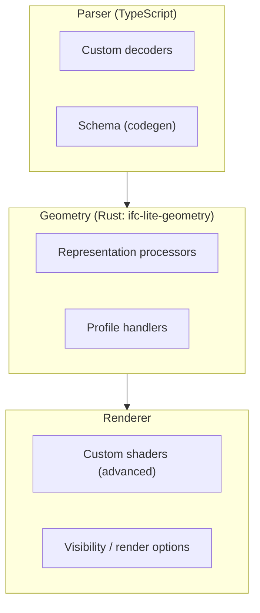

# Extending the Parser

Learn to extend IFClite with custom functionality.

## Extension Points



## Custom Entity Decoders

### Creating a Decoder

```typescript
import {
  IfcDataStore,
  EntityRef,
  extractEntityAttributesOnDemand,
  extractPropertiesOnDemand,
  extractQuantitiesOnDemand,
} from '@ifc-lite/parser';

// Define custom entity interface
interface CustomDoorData {
  expressId: number;
  globalId: string;
  name: string;
  width: number;
  height: number;
  isExternal: boolean;
  fireRating: number;
}

// Create custom decoder
class DoorDecoder {
  constructor(
    private store: IfcDataStore,
    private buffer: Uint8Array
  ) {}

  decode(entity: EntityRef): CustomDoorData {
    // Use on-demand extraction for properties
    const psets = extractPropertiesOnDemand(this.store, entity.expressId);
    const qsets = extractQuantitiesOnDemand(this.store, entity.expressId);

    // EntityRef only carries { expressId, type, byteOffset, byteLength, lineNumber },
    // so globalId/name must be resolved from the source buffer on demand.
    const attrs = extractEntityAttributesOnDemand(this.store, entity.expressId);

    // Both extractors return arrays of sets: find the set by name,
    // then the entry inside it by name.
    const findProp = (psetName: string, propName: string) =>
      psets.find(p => p.name === psetName)
        ?.properties.find(prop => prop.name === propName)?.value;
    const findQuantity = (qtyName: string) =>
      qsets.flatMap(q => q.quantities).find(qty => qty.name === qtyName)?.value;

    return {
      expressId: entity.expressId,
      globalId: attrs.globalId,
      name: attrs.name || 'Unknown Door',
      width: Number(findQuantity('Width')) || 0,
      height: Number(findQuantity('Height')) || 0,
      isExternal: Boolean(findProp('Pset_DoorCommon', 'IsExternal')),
      fireRating: Number(findProp('Pset_DoorCommon', 'FireRating')) || 0
    };
  }

  decodeAll(): CustomDoorData[] {
    const doorIds = this.store.entityIndex.byType.get('IFCDOOR') ?? [];
    return doorIds.map(id => {
      const ref = this.store.entityIndex.byId.get(id)!;
      return this.decode(ref);
    });
  }
}

// Usage
const buffer = new Uint8Array(arrayBuffer);
const doorDecoder = new DoorDecoder(store, buffer);
const doors = doorDecoder.decodeAll();
```

### Streaming Decoder

Stream and decode entities as geometry is processed:

```typescript
import { GeometryProcessor } from '@ifc-lite/geometry';
import { IfcParser, type IfcDataStore, extractPropertiesOnDemand } from '@ifc-lite/parser';

class StreamingDecoder<T> {
  private handlers = new Map<string, (expressId: number, store: IfcDataStore, buffer: Uint8Array) => T>();

  register(type: string, handler: (expressId: number, store: IfcDataStore, buffer: Uint8Array) => T): void {
    this.handlers.set(type, handler);
  }

  async *decode(
    store: IfcDataStore,
    buffer: Uint8Array,
    geometry: GeometryProcessor
  ): AsyncGenerator<T> {
    for await (const event of geometry.processStreaming(buffer)) {
      if (event.type === 'batch') {
        for (const mesh of event.meshes) {
          const entityRef = store.entityIndex.byId.get(mesh.expressId);
          if (entityRef) {
            const handler = this.handlers.get(entityRef.type);
            if (handler) {
              yield handler(mesh.expressId, store, buffer);
            }
          }
        }
      }
    }
  }
}

// Usage
const decoder = new StreamingDecoder<CustomDoorData>();
decoder.register('IFCDOOR', (expressId, store) => {
  const psets = extractPropertiesOnDemand(store, expressId);
  const fireRating = psets.find(p => p.name === 'Pset_DoorCommon')
    ?.properties.find(prop => prop.name === 'FireRating')?.value;
  return {
    expressId,
    fireRating: Number(fireRating) || 0,
    // ... decode door
  };
});

for await (const door of decoder.decode(store, new Uint8Array(buffer), geometry)) {
  console.log(door);
}
```

## Custom Geometry Processors

Geometry generation is not pluggable from TypeScript. Meshing runs in the Rust
`ifc-lite-geometry` crate (compiled to WASM), so a new representation or profile
handler is added by contributing a processor to that crate rather than by
registering a class at runtime:

- Representation and profile handling lives in `rust/geometry/src/processors/`
  and `rust/geometry/src/profiles/`.
- The `GeometryRouter` (`rust/geometry/src/router/mod.rs`) dispatches each
  representation to the right processor.
- See [Geometry Pipeline](../architecture/geometry-pipeline.md) for how a
  representation flows from the parser to a mesh.

On the TypeScript side, `GeometryProcessor` from `@ifc-lite/geometry` is a
concrete driver, not an extension point: it exposes `init()`,
`process(buffer, entityIndex?)` (returns a `GeometryResult`), plus the
streaming iterators `processStreaming(buffer)` and
`processAdaptive(buffer, options?)`. To customize output, consume that result
and transform the `MeshData[]` yourself:

```typescript
import { GeometryProcessor } from '@ifc-lite/geometry';

const gp = new GeometryProcessor();
await gp.init();
const result = await gp.process(new Uint8Array(buffer));

// Post-process the produced meshes (custom simplification, tagging, etc.)
const processed = result.meshes.map((mesh) => transformMesh(mesh));
```

## Schema Extensions

### Adding Custom Entity Types

The IFC entity schema is generated from the official EXPRESS definitions at
build time, not registered at runtime. To add or change entity definitions,
regenerate the schema with `@ifc-lite/codegen` from a modified EXPRESS file and
rebuild the parser:

```typescript
import { parseExpressSchema, generateTypeScript } from '@ifc-lite/codegen';

const schema = parseExpressSchema(expressSource);
const generated = generateTypeScript(schema);
// generated.entities / .types / .enums / .selects / .schemaRegistry are TS source.
// Write them into packages/parser/src/generated, then rebuild the parser.
```

For one-off vendor extensions whose schema you do not control, do not extend the
schema. Read the raw attributes of unknown entities on demand instead (see the
on-demand extractors above and [Custom Queries](custom-queries.md)).

### Custom Property Extractors

There is no `PropertyExtractor` base class to subclass. Compose the standalone
`extractPropertiesOnDemand` helper with your own function instead:

```typescript
import { extractPropertiesOnDemand, type IfcDataStore } from '@ifc-lite/parser';

function extractCustom(store: IfcDataStore, expressId: number): Record<string, unknown> {
  const psets = extractPropertiesOnDemand(store, expressId);
  const findProp = (psetName: string, propName: string) =>
    psets.find((p) => p.name === psetName)
      ?.properties.find((prop) => prop.name === propName)?.value;

  return {
    isExternal: Boolean(findProp('Pset_WallCommon', 'IsExternal')),
    fireRating: Number(findProp('Pset_WallCommon', 'FireRating')) || 0,
  };
}
```

## Renderer Extensions

### Custom Shaders

```typescript
import { Renderer } from '@ifc-lite/renderer';

const customVertexShader = `
  struct Uniforms {
    viewProjection: mat4x4<f32>,
    model: mat4x4<f32>,
    customParam: f32,
  }

  @group(0) @binding(0) var<uniform> uniforms: Uniforms;

  @vertex
  fn main(@location(0) position: vec3<f32>) -> @builtin(position) vec4<f32> {
    // Custom vertex transformation
    let modified = position * uniforms.customParam;
    return uniforms.viewProjection * uniforms.model * vec4(modified, 1.0);
  }
`;

const customFragmentShader = `
  @fragment
  fn main() -> @location(0) vec4<f32> {
    // Custom fragment coloring
    return vec4(1.0, 0.0, 0.0, 1.0);
  }
`;

// Note: Custom shader registration is an advanced feature
// Requires extending the renderer's pipeline
```

!!! note "Custom Rendering"
    Custom shaders and dynamic per-entity coloring are advanced features
    not exposed in the current public API. For custom rendering needs,
    consider extending the Renderer class or contributing to the project.

### Visibility-Based Highlighting

For highlighting specific entities, use visibility controls:

```typescript
import { Renderer } from '@ifc-lite/renderer';

class HighlightManager {
  isolated: Set<number> | null = null;
  hidden = new Set<number>();
  selected = new Set<number>();

  isolate(expressIds: number[]): void {
    this.isolated = new Set(expressIds);
  }

  hide(expressIds: number[]): void {
    expressIds.forEach(id => this.hidden.add(id));
  }

  select(expressIds: number[]): void {
    this.selected = new Set(expressIds);
  }

  clearAll(): void {
    this.isolated = null;
    this.hidden.clear();
    this.selected.clear();
  }

  applyToRenderer(renderer: Renderer): void {
    renderer.render({
      isolatedIds: this.isolated,
      hiddenIds: this.hidden,
      selectedIds: this.selected
    });
  }
}
```

## Plugin System

### Creating a Plugin

```typescript
interface IfcLitePlugin {
  name: string;
  version: string;

  // Lifecycle hooks
  onInit?(context: PluginContext): void;
  onParse?(store: IfcDataStore): void;
  onGeometry?(meshes: MeshData[]): void;
  onRender?(renderer: Renderer): void;
  onDispose?(): void;
}

interface PluginContext {
  parser: IfcParser;
  renderer: Renderer;
  query: IfcQuery;
}

// Example plugin
class AnalyticsPlugin implements IfcLitePlugin {
  name = 'analytics';
  version = '1.0.0';

  onParse(store: IfcDataStore): void {
    console.log('Parse statistics:', {
      entities: store.entities.count,
    });
  }
}
```

### Plugin Manager

```typescript
class PluginManager {
  private plugins: IfcLitePlugin[] = [];

  register(plugin: IfcLitePlugin): void {
    this.plugins.push(plugin);
    console.log(`Registered plugin: ${plugin.name} v${plugin.version}`);
  }

  async init(context: PluginContext): Promise<void> {
    for (const plugin of this.plugins) {
      await plugin.onInit?.(context);
    }
  }

  onParse(store: IfcDataStore): void {
    for (const plugin of this.plugins) {
      plugin.onParse?.(store);
    }
  }

  // ... other lifecycle methods
}

// Usage
const plugins = new PluginManager();
plugins.register(new AnalyticsPlugin());

const store = await parser.parseColumnar(buffer);
plugins.onParse(store);
```

## Best Practices

### 1. Keep Extensions Focused

<!-- docs-check: skip -->
```typescript
// Good: Single responsibility
class FireRatingExtractor {
  extract(store: IfcDataStore, expressId: number): number | null { ... }
}

// Bad: Too many responsibilities
class EverythingExtractor {
  extractFireRating(store: IfcDataStore, expressId: number): number { ... }
  extractMaterials(store: IfcDataStore, expressId: number): Material[] { ... }
  // ...
}
```

### 2. Use TypeScript Generics

```typescript
class TypedDecoder<T> {
  constructor(
    private decode: (entity: EntityRef) => T
  ) {}

  decodeAll(entities: EntityRef[]): T[] {
    return entities.map(this.decode);
  }
}

const doorDecoder = new TypedDecoder<CustomDoorData>(decodeDoor);
```

### 3. Handle Errors Gracefully

```typescript
class SafeExtractor {
  extract(store: IfcDataStore, expressId: number): Record<string, unknown> | null {
    try {
      return this.doExtract(store, expressId);
    } catch (error) {
      console.warn(`Failed to extract #${expressId}:`, error);
      return null; // Return null instead of throwing
    }
  }

  // Your real extraction logic goes here.
  private doExtract(store: IfcDataStore, expressId: number): Record<string, unknown> {
    return {};
  }
}
```

## Next Steps

- [API Reference](../api/typescript.md) - Full API documentation
- [Architecture](../architecture/overview.md) - System design
